# mkdx.vim [](https://github.com/SidOfc/mkdx/releases) [](https://github.com/SidOfc/mkdx/issues)

```mkdx
          888b     d888 888    d8P  8888888b. Y88b   d88P    888     888 8888888 888b     d888
  , - /|  8888b   d8888 888   d8P   888  "Y88b Y88b d88P     888     888   888   8888b   d8888  |\ - ,
 / = / |  88888b.d88888 888  d8P    888    888  Y88o88P      888     888   888   88888b.d88888  | \ = \
/ = /  |  888Y88888P888 888d88K     888    888   Y888P       Y88b   d88P   888   888Y88888P888  |  \ = \
\ = \  |  888 Y888P 888 8888888b    888    888   d888b        Y88b d88P    888   888 Y888P 888  |  / = /
 \ = \ |  888  Y8P  888 888  Y88b   888    888  d88888b        Y88o88P     888   888  Y8P  888  | / = /
  ' - \|  888   "   888 888   Y88b  888  .d88P d88P Y88b  d8b   Y888P      888   888   "   888  |/ - '
          888       888 888    Y88b 8888888P" d88P   Y88b Y8P    Y8P     8888888 888       888
```

mkdx.vim is a `markdown` plugin that aims to reduce the time you spend formatting your
markdown documents. It does this by adding some configurable mappings for files with a
markdown **filetype**. Functions are included to handle lists, checkboxes (even lists of checkboxes!), fenced code blocks,
shortcuts, headers and links. In addition to that, this plugin provides a mapping to convert a selection
of CSV data to a markdown table. And there's a lot more :D
Visit `:h mkdx` or `:h mkdx-helptags` for more information.

A copy can be found on [vim.sourceforge.io](https://vim.sourceforge.io/scripts/script.php?script_id=5620).
This plugin is also compatible with [repeat.vim](https://github.com/tpope/vim-repeat) by Tim Pope.
Every _normal_ mode mapping can be repeated with the `.` command. Below you will find configurable
settings and examples with default mappings.

# Honorable mentions

Before we dive in I'd like to give a special thanks to the following contributors for posting issues and PRs:

- [@yous](https://github.com/yous)
    - discovering a bug when using unicode characters in list items
- [@marcdeop](https://github.com/marcdeop) ([Erasys](https://www.erasys.de/))
    - discovering and fixing a bug when using `&sw` with a value of `0`.
- [@totpet](https://github.com/totpet)
    - idea to compress GIFs to greatly reduce repository size
    - idea for <strike>strikethrough</strike> highlighting
- [@toffalori](https://github.com/toffalori)
    - discovering an indent bug in Vim due to `autoindent` different default value
- [@paxtemper](https://github.com/paxtemper)
    - idea for list / checklist / checkbox toggles and checkbox highlight states
    - discovering two bugs

Thank you for making this plugin better!

# Table of Contents

<details>
<summary>Click to expand Table of Contents</summary>
<ul>
    <li><a href="#mkdxvim--">mkdx.vim</a></li>
    <li><a href="#honorable-mentions">Honorable mentions</a></li>
    <li><a href="#table-of-contents">Table of Contents</a></li>
    <li><a href="#install">Install</a></li>
    <li><a href="#quick-start">Quick start</a></li>
    <li><a href="#examples">Examples</a><details><summary>show 22 items</summary><ul>
        <li><a href="#folds">Folds</a></li>
        <li><a href="#insert-mode-fragment-completion">Insert mode fragment completion</a></li>
        <li><a href="#dead-link-detection">Dead link detection</a></li>
        <li><a href="#insert-fenced-code-block">Insert fenced code block</a></li>
        <li><a href="#insert-kbdkbd-shortcut">Insert <code>&lt;kbd&gt;&lt;/kbd&gt;</code> shortcut</a></li>
        <li><a href="#inserting-list-items">Inserting list items</a></li>
        <li><a href="#toggling-lines-from--to-task-items">Toggling lines from / to task items</a></li>
        <li><a href="#toggling-lines-from--to-list-items">Toggling lines from / to list items</a></li>
        <li><a href="#toggling-lines-from--to-checklist-items">Toggling lines from / to checklist items</a></li>
        <li><a href="#completing-checkboxes--checklists">Completing Checkboxes / Checklists</a></li>
        <li><a href="#toggling-and-promoting--demoting-headers">Toggling and promoting / demoting Headers</a></li>
        <li><a href="#toggling-kbd--shortcuts">Toggling &lt;kbd /&gt; shortcuts</a></li>
        <li><a href="#toggling-quotes">Toggling Quotes</a></li>
        <li><a href="#wrap-as-link">Wrap as link</a></li>
        <li><a href="#wrap-as-bold--italic--inline-code--strikethrough">Wrap as bold / italic / inline-code / strikethrough</a></li>
        <li><a href="#convert-csv-to-table-and-back">Convert CSV to table (and back)</a></li>
        <li><a href="#jump-to-header">Jump to header</a></li>
        <li><a href="#generate-or-update-toc">Generate or update TOC</a></li>
        <li><a href="#generate-or-update-toc-as-details">Generate or update TOC as <code>&lt;details&gt;</code></a></li>
        <li><a href="#open-toc-in-quickfix-window">Open TOC in quickfix window</a></li>
        <li><a href="#open-toc-using-fzf-instead-of-quickfix-window">Open TOC using fzf instead of quickfix window</a></li>
        <li><a href="#using-the-menu">Using the menu</a></li>
    </ul></details></li>
    <li><a href="#gmkdxsettings"><code>g:mkdx#settings</code></a><details><summary>show 42 items</summary><ul>
        <li><a href="#gmkdxsettingslinksexternalenable"><code>g:mkdx#settings.links.external.enable</code></a></li>
        <li><a href="#gmkdxsettingslinksexternaltimeout"><code>g:mkdx#settings.links.external.timeout</code></a></li>
        <li><a href="#gmkdxsettingslinksexternalhost"><code>g:mkdx#settings.links.external.host</code></a></li>
        <li><a href="#gmkdxsettingslinksexternalrelative"><code>g:mkdx#settings.links.external.relative</code></a></li>
        <li><a href="#gmkdxsettingslinksexternaluser_agent"><code>g:mkdx#settings.links.external.user_agent</code></a></li>
        <li><a href="#gmkdxsettingslinksfragmentjumplist"><code>g:mkdx#settings.links.fragment.jumplist</code></a></li>
        <li><a href="#gmkdxsettingslinksfragmentcomplete"><code>g:mkdx#settings.links.fragment.complete</code></a></li>
        <li><a href="#gmkdxsettingsimage_extension_pattern"><code>g:mkdx#settings.image_extension_pattern</code></a></li>
        <li><a href="#gmkdxsettingsrestore_visual"><code>g:mkdx#settings.restore_visual</code></a></li>
        <li><a href="#gmkdxsettingsmapprefix"><code>g:mkdx#settings.map.prefix</code></a></li>
        <li><a href="#gmkdxsettingsmapenable"><code>g:mkdx#settings.map.enable</code></a></li>
        <li><a href="#gmkdxsettingscheckboxtoggles"><code>g:mkdx#settings.checkbox.toggles</code></a></li>
        <li><a href="#gmkdxsettingscheckboxupdate_tree"><code>g:mkdx#settings.checkbox.update_tree</code></a></li>
        <li><a href="#gmkdxsettingscheckboxinitial_state"><code>g:mkdx#settings.checkbox.initial_state</code></a></li>
        <li><a href="#gmkdxsettingstokensheader"><code>g:mkdx#settings.tokens.header</code></a></li>
        <li><a href="#gmkdxsettingstokensenter"><code>g:mkdx#settings.tokens.enter</code></a></li>
        <li><a href="#gmkdxsettingstokensfence"><code>g:mkdx#settings.tokens.fence</code></a></li>
        <li><a href="#gmkdxsettingstokensitalic"><code>g:mkdx#settings.tokens.italic</code></a></li>
        <li><a href="#gmkdxsettingstokensbold"><code>g:mkdx#settings.tokens.bold</code></a></li>
        <li><a href="#gmkdxsettingstokensstrike"><code>g:mkdx#settings.tokens.strike</code></a></li>
        <li><a href="#gmkdxsettingstokenslist"><code>g:mkdx#settings.tokens.list</code></a></li>
        <li><a href="#gmkdxsettingstableheader_divider"><code>g:mkdx#settings.table.header_divider</code></a></li>
        <li><a href="#gmkdxsettingstabledivider"><code>g:mkdx#settings.table.divider</code></a></li>
        <li><a href="#gmkdxsettingstablealign"><code>g:mkdx#settings.table.align</code></a></li>
        <li><a href="#gmkdxsettingsentershift"><code>g:mkdx#settings.enter.shift</code></a></li>
        <li><a href="#gmkdxsettingsenterenable"><code>g:mkdx#settings.enter.enable</code></a></li>
        <li><a href="#gmkdxsettingsentero"><code>g:mkdx#settings.enter.o</code></a></li>
        <li><a href="#gmkdxsettingsentershifto"><code>g:mkdx#settings.enter.shifto</code></a></li>
        <li><a href="#gmkdxsettingsentermalformed"><code>g:mkdx#settings.enter.malformed</code></a></li>
        <li><a href="#gmkdxsettingstoctext"><code>g:mkdx#settings.toc.text</code></a></li>
        <li><a href="#gmkdxsettingstoclist_token"><code>g:mkdx#settings.toc.list_token</code></a></li>
        <li><a href="#gmkdxsettingstocupdate_on_write"><code>g:mkdx#settings.toc.update_on_write</code></a></li>
        <li><a href="#gmkdxsettingstocposition"><code>g:mkdx#settings.toc.position</code></a></li>
        <li><a href="#gmkdxsettingstocdetailsenable"><code>g:mkdx#settings.toc.details.enable</code></a></li>
        <li><a href="#gmkdxsettingstocdetailssummary"><code>g:mkdx#settings.toc.details.summary</code></a></li>
        <li><a href="#gmkdxsettingstocdetailsnesting_level"><code>g:mkdx#settings.toc.details.nesting_level</code></a></li>
        <li><a href="#gmkdxsettingstocdetailschild_count"><code>g:mkdx#settings.toc.details.child_count</code></a></li>
        <li><a href="#gmkdxsettingstocdetailschild_summary"><code>g:mkdx#settings.toc.details.child_summary</code></a></li>
        <li><a href="#gmkdxsettingshighlightenable"><code>g:mkdx#settings.highlight.enable</code></a></li>
        <li><a href="#gmkdxsettingsauto_updateenable"><code>g:mkdx#settings.auto_update.enable</code></a></li>
        <li><a href="#gmkdxsettingsfoldenable"><code>g:mkdx#settings.fold.enable</code></a></li>
        <li><a href="#gmkdxsettingsfoldcomponents"><code>g:mkdx#settings.fold.components</code></a></li>
    </ul></details></li>
    <li><a href="#mappings">Mappings</a><ul>
        <li><a href="#remapping-functionality">Remapping functionality</a></li>
        <li><a href="#unmapping-functionality-using-nop">Unmapping functionality using <code>&lt;Nop&gt;</code></a></li>
        <li><a href="#unmapping-functionality-using-plug">Unmapping functionality using <code>&lt;Plug&gt;</code></a></li>
    </ul></li>
    <li><a href="#supported-grep-programs">Supported <code>grep</code> programs</a></li>
    <li><a href="#contributing">Contributing</a></li>
    <li><a href="#roadmap">Roadmap</a></li>
    <li><a href="#changelog">Changelog</a><ul>
        <li><a href="#10-05-2019-version-191">10-05-2019 VERSION 1.9.1</a></li>
        <li><a href="#23-11-2018-version-190">23-11-2018 VERSION 1.9.0</a></li>
        <li><a href="#20-11-2018-version-183">20-11-2018 VERSION 1.8.3</a></li>
    </ul></li>
</ul>
</details>

# Install

This plugin is tested using [Vader.vim](https://github.com/junegunn/vader.vim) in _vim_, _nvim_ and _mvim_.

To install, use a plugin manager of choice like
[Vundle](https://github.com/VundleVim/Vundle.vim) or [Pathogen](https://github.com/tpope/vim-pathogen).

[Vundle](https://github.com/VundleVim/Vundle.vim)
```viml
Plugin 'SidOfc/mkdx'

:so $MYVIMRC
:PluginInstall
```

[NeoBundle](https://github.com/Shougo/neobundle.vim)
```viml
NeoBundle 'SidOfc/mkdx'

:so $MYVIMRC
:NeoBundleInstall
```

[vim-plug](https://github.com/junegunn/vim-plug)
```viml
Plug 'SidOfc/mkdx'

:so $MYVIMRC
:PlugInstall
```

[Pathogen](https://github.com/tpope/vim-pathogen)
```sh
cd ~/.vim/bundle
git clone https://github.com/SidOfc/mkdx
```

# Quick start

This plugin is extremely customizable, there are __a lot__ of [settings](#gmkdxsettings) and [examples](#examples) to go through. Some of the best settings are disabled because they might not perform on some specific setup or the functionality may interfere with other plugins who are better suited for specific tasks (e.g. highlighting is only a minor 'enhancement' in this plugin).

**quick setup**
```viml
let g:mkdx#settings     = { 'highlight': { 'enable': 1 },
                        \ 'enter': { 'shift': 1 },
                        \ 'links': { 'external': { 'enable': 1 } },
                        \ 'toc': { 'text': 'Table of Contents', 'update_on_write': 1 },
                        \ 'fold': { 'enable': 1 } }
let g:polyglot_disabled = ['markdown'] " for vim-polyglot users, it loads Plasticboy's markdown
                                       " plugin which unfortunately interferes with mkdx list indentation.
```

The above snippet enables:

- Folding of inline code blocks and the table of contents
- Makes dead link detection also check for external links instead of only checking `#` links
- Enables <kbd>shift</kbd>+<kbd>enter</kbd> support for multi line list items (__please ensure__ that it works [correctly](#gmkdxsettingsentershift)).
- Changes the default table of contents text from `TOC` to `Table of Contents`
- Updates the table of contents automatically before saving the file
- Enables better syntax highlighting for tables, list items, check boxes with certain states, <kbd>kbd</kbd> tags and bold+italic markers

There is much more that can be configured, [go here](#gmkdxsettings) for an overview of the defaults or check out the examples below :)

# Examples

## Folds

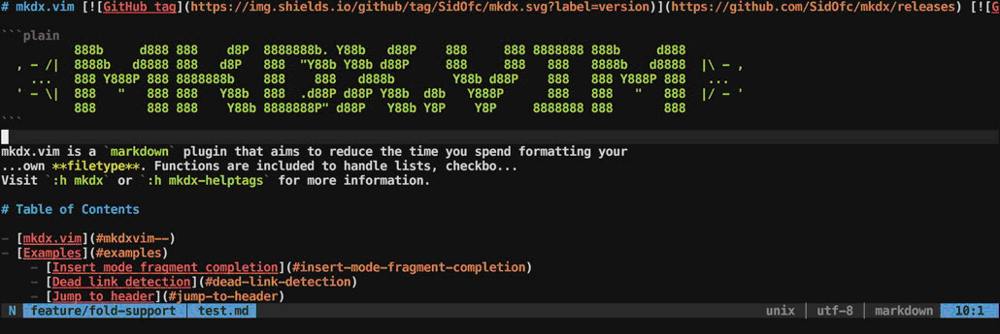

Folding in mkdx can be enabled by setting [`g:mkdx#settings.fold.enable`](#gmkdxsettingsfoldenable) to `1`.
Both the table of contents and fenced code blocks can be folded independently as well, see [`g:mkdx#settings.fold.components`](#gmkdxsettingsfoldcomponents) for more information.
We also see a tiny bit of [auto update](#gmkdxsettingsauto_updateenable) in this example, that shows that the new value gets applied instantly.

## Insert mode fragment completion

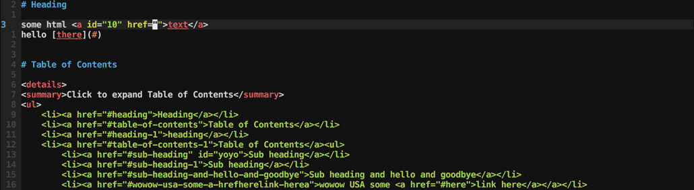

When inside a link, typing a url that starts with a `#` will show a list of autocompletions based on the links of all the headers in the document.
This functionality uses Vim's builtin `complete` (`:h complete()`) and `completefunc` (`:h completefunc`) for autocompletions.
Use <kbd>ctrl</kbd>+<kbd>n</kbd> to select the next entry and <kbd>ctrl</kbd>+<kbd>p</kbd> to select the previous entry.

When not inside a link, fragment autocompletions will not be triggered and default autocompletion is used instead.
To complete a fragment outside of a link, type a `#` followed by <kbd>ctrl</kbd>+<kbd>n</kbd> or <kbd>ctrl</kbd>+<kbd>p</kbd>.

Insert mode autocompletions can be disabled by setting the value of [`g:mkdx#settings.links.fragment.complete`](#gmkdxsettingslinksfragmentcomplete) to `0`.
**note:** [`g:mkdx#settings.map.enable`](#gmkdxsettingsmapenable) must be enabled for <kbd>ctrl</kbd>+<kbd>n</kbd> and <kbd>ctrl</kbd>+<kbd>p</kbd> mappings to be bound.

```viml
" :h mkdx-mapping-insert-completions
" :h mkdx-function-insert-ctrl-n-handler
" :h mkdx-function-insert-ctrl-p-handler
" :h mkdx-function-complete-link
" :h mkdx-function-complete
" :h mkdx-plug-ctrl-n-compl
" :h mkdx-plug-ctrl-p-compl
" :h mkdx-plug-link-compl
```

## Dead link detection

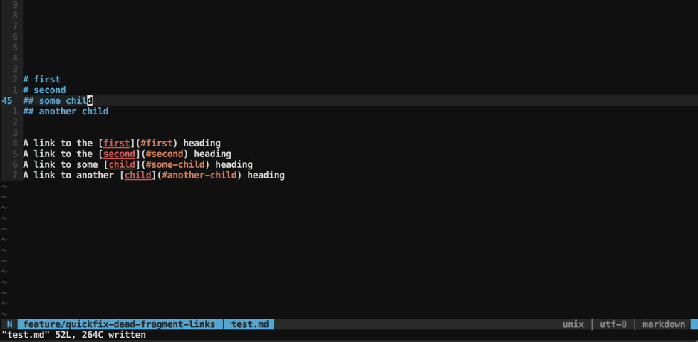

Often when writing documentation, you'll find the need to point to some other location on the same page.
So you go ahead and write that fragment URL and forget about it. Later you come back to this file and you change the header (thus changing the output fragment for that header),
but you **forgot** you even had a link to it in the first place! A new broken link is born :/

Well, no more -- Press <kbd>[\<PREFIX\>](#gmkdxsettingsmapprefix)</kbd><kbd>L</kbd> and Vim's `quickfix` window
will come to your rescue. It will compare all fragment links in the document to those of the headers and show you which ones don't match.
Now you can safely change a header, if you want to know if you broke anything you know the mapping :)

External links will also be checked, your (n/m/g)vim must support either Vim's `job` or Neovim's `job-control` in order for this to be enabled.
`curl` and `git` will also be used to send requests or create an absolute path for relative links.
See [`g:mkdx#settings.links.external.enable`](#gmkdxsettingslinksexternalenable) for more information and other settings.

```viml
" :h mkdx-mapping-quickfix-dead-links
" :h mkdx-function-quickfix-dead-links
" :h mkdx-plug-quickfix-links
```

## Insert fenced code block

|Backtick|Tilde|
|--------|-----|
|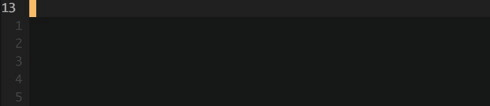||

As seen in the gifs, entering either 3 consecutive `` ` `` or `~` characters in _insert_ mode will complete the block
and put the cursor at the end of the opening fence to allow adding a language. The behaviour is controlled
by [`g:mkdx#settings.map.enable`](#gmkdxsettingsmapenable) and like other mappings, it is only mapped if no mapping exists.

Fence style can be controlled using [`g:mkdx#settings.tokens.fence`](#gmkdxsettingstokensfence). This allows you to use one style
for both `` ` `` and `~` blocks.

**Note** that if you want to copy the _{rhs}_ of this mapping in a mapping in your vimrc, you will need to replace
`<C-o>` with a literal `^o` character. In vim, this can be achieved by pressing <kbd>ctrl</kbd>+<kbd>v</kbd> followed
by <kbd>ctrl</kbd>+<kbd>o</kbd>.

```viml
" :h mkdx-mapping-insert-fenced-code-block
  inoremap <buffer><silent><unique> ~~~ ~~~<Enter>~~~<C-o>k<C-o>A
  inoremap <buffer><silent><unique> ``` ```<Enter>```<C-o>k<C-o>A
```

## Insert `<kbd></kbd>` shortcut


This mapping works in _insert_ mode by pressing <kbd>\<</kbd>+<kbd>tab</kbd>.
This mapping is just a regular `imap` that inserts `<kbd></kbd>` and puts your cursor in the tag afterwards.
The behaviour is controlled by [`g:mkdx#settings.map.enable`](#gmkdxsettingsmapenable) and like other mappings,
it is only mapped if no mapping exists.

**Note** that if you want to copy the _{rhs}_ of this mapping in a mapping in your vimrc, you will need to replace
`<C-o>` with a literal `^o` character. In vim, this can be achieved by pressing <kbd>ctrl</kbd>+<kbd>v</kbd> followed
by <kbd>ctrl</kbd>+<kbd>o</kbd>.

```viml
" :h mkdx-mapping-insert-kbd-shortcut
imap <buffer><silent><unique> <<Tab> <kbd></kbd><C-o>2h<C-o>cit
```

## Inserting list items

|Unordered|Numbered|
|---------|--------|
|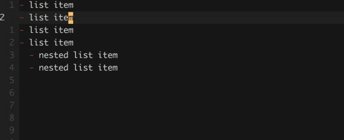|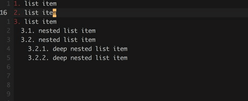|

When [`g:mkdx#settings.enter.enable`](#gmkdxsettingsenterenable) is set (default on), new list tokens will be inserted when
editing a markdown list. This happens on any <kbd>enter</kbd> in _insert_ mode or <kbd>o</kbd> and <kbd>O</kbd> in normal mode by default.
Additionally, if the list item contains a checkbox (`[ ]` - any state possible) that will also be appended to
the newly inserted item.

Sometimes, you might need to write a multi-line list item, this can be achieved by enabling [`g:mkdx#settings.enter.shift`](#gmkdxsettingsentershift).
Once enabled, pressing <kbd>shift</kbd>+<kbd>enter</kbd> will place the cursor on a new line, indented to where the text started on the previous line.
Press <kbd>shift</kbd>+<kbd>enter</kbd> while you want to add lines to the current item, a regular <kbd>enter</kbd> will create a new list item at the
previous indentation level.

```viml
" :h mkdx-mapping-list-items
" :h mkdx-setting-enter-enable
" :h mkdx-setting-enter-shift
" :h mkdx-setting-tokens-list
" :h mkdx-function-enter-handler
" :h mkdx-function-shift-enter-handler
```

## Toggling lines from / to task items

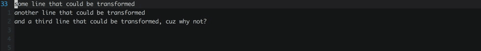

Checkboxes can be toggled using <kbd>[\<PREFIX\>](#gmkdxsettingsmapprefix)</kbd><kbd>t</kbd>.
This will cause a checkbox to be prepended before the line if it doesn't exist.
The checkbox will be removed instead, if it exists. The initial state can be defined using [`g:mkdx#settings.checkbox.initial_state`](#gmkdxsettingscheckboxinitial_state).

When toggling a checkbox in a list or checklist, the checkbox will be added / removed accordingly:

```
- list item           => - [ ] list item
- [ ] checklist item  => - checklist item
* [ ] checklist item  => * checklist item
1. [ ] checklist item => 1. checklist item
```

**Note:** the list / checklist support has been added in version *0.4.1*. Prior to that,
the checkbox would be inserted at the start of the line instead of after the list token.

```viml
" :h mkdx-mapping-toggle-checkbox
" :h mkdx-function-toggle-checkbox-task
```

## Toggling lines from / to list items


Lists can be toggled using <kbd>[\<PREFIX\>](#gmkdxsettingsmapprefix)</kbd><kbd>l</kbd><kbd>l</kbd>.
This will cause a [list token](#gmkdxsettingstokenslist) to be inserted. When present, it will be removed.

When toggling a checkbox or a checklist item, the list token will be added / removed accordingly:

```
[ ] checkbox item     => - [ ] checkbox item
- [ ] checklist item  => - checklist item
* [ ] checklist item  => * checklist item
1. [ ] checklist item => 1. checklist item
```

**Note:** the checklist support has been added in version *0.4.1*. Prior to that,
tokens other than [`g:mkdx#settings.tokens.list`](#gmkdxsettingstokenslist) weren't toggled.

```viml
" :h mkdx-mapping-toggle-list
" :h mkdx-function-toggle-list
```

## Toggling lines from / to checklist items


Checklists can be toggled using <kbd>[\<PREFIX\>](#gmkdxsettingsmapprefix)</kbd><kbd>l</kbd><kbd>t</kbd>.
This will cause a [list token](#gmkdxsettingstokenslist) followed by a checkbox to be prepended before the line if it doesn't exist.
If it is already present, it will be removed. Like [Checkboxes](#completing-checkboxes--checklists), the initial state of the checkbox can be defined using: [`g:mkdx#settings.checkbox.initial_state`](#gmkdxsettingscheckboxinitial_state).

If the current line or selection is one or multiple list items, a checkbox with state of [`g:mkdx#settings.checkbox.initial_state`](#gmkdxsettingscheckboxinitial_state) will be added:

```
- list item  => - [ ] list item
* list item  => * [ ] list item
1. list item => 1. [ ] list item
```

If the current line or selection is one or multiple checkboxes, a [`g:mkdx#settings.tokens.list`](#gmkdxsettingstokenslist) will be added.
Any state the checkbox is in will be preserved:

```
[ ] list item  => - [ ] list item
[x] list item  => - [x] list item
```

**note:** the list item / checkbox support has been added in version *0.4.1*. Prior to that,
toggling checklists only performed a check to see if a checklist item was present or not.

```viml
" :h mkdx-mapping-toggle-checklist
" :h mkdx-function-toggle-checklist
```

## Completing Checkboxes / Checklists

**Single checkbox:**
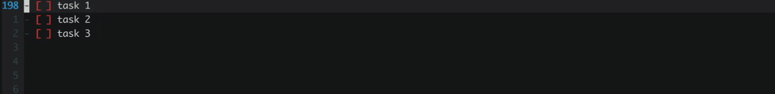

**Checkbox in checklist:**
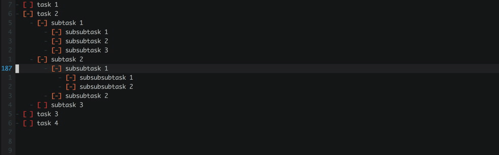

Checkboxes can be checked using <kbd>[\<PREFIX\>](#gmkdxsettingsmapprefix)</kbd><kbd>=</kbd> and <kbd>[\<PREFIX\>](#gmkdxsettingsmapprefix)</kbd><kbd>-</kbd>.
checking a checkbox means going to the previous or next mark in the list of [`g:mkdx#settings.checkbox.toggles`](#gmkdxsettingscheckboxtoggles).
When checking an item which is nested in a list, the parent and child list items will be updated as well.
Automatic updating of checkboxes can be disabled by setting [`g:mkdx#settings.checkbox.update_tree`](#gmkdxsettingscheckboxupdate_tree).
All manipulations work fine in visual as well as normal mode.

You can also see that the checkboxes are highlighted differently depending on state. This is an _opt-in_ setting which you must enable explicitly in your vimrc.
See [`g:mkdx#settings.highlight.enable`](#gmkdxsettingshighlightenable) for more information.

A file might not always be indented correctly, the solution to this is [`g:mkdx#settings.enter.malformed`](#gmkdxsettingsentermalformed).
This setting is enabled by default, it rounds invalid (indentation not divisible by `:h shiftwidth`) either up or down
to the nearest indentation level. In the examples below, the `shiftwidth` is set to `4`. The second item is indented by `3` spaces and the
third item is indented by `5` spaces. since `3` is closer to `4` than `0`, it will become `4`. In the case of `5`, it's closer to `4` than `8`
and will also become `4`.

| off | on |
|:---:|:--:|
|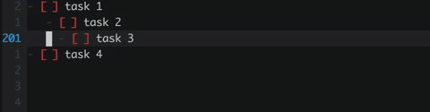||

```viml
" :h mkdx-mapping-toggle-checkbox-forward
" :h mkdx-mapping-toggle-checkbox-backward
" :h mkdx-function-toggle-checkbox
```

## Toggling and promoting / demoting Headers

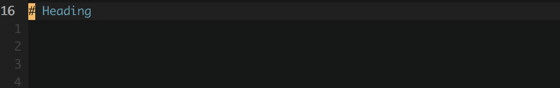

Increment or decrement a heading with <kbd>[\<PREFIX\>](#gmkdxsettingsmapprefix)</kbd><kbd>\[</kbd> and <kbd>[\<PREFIX\>](#gmkdxsettingsmapprefix)</kbd><kbd>\]</kbd>.
As can be seen in the gif, headings can be toggled as well as promoted / demoted with these mappings.
The header character can be changed using [`g:mkdx#settings.tokens.header`](#gmkdxsettingstokensheader).

```viml
" :h mkdx-mapping-increment-header-level
" :h mkdx-mapping-decrement-header-level
" :h mkdx-function-toggle-header
```

## Toggling \<kbd /> shortcuts

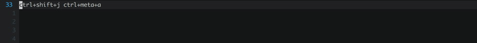

**Note:** *does not work with multiline selection*

Quickly toggle plain text shortcuts to markdown shortcuts and back with <kbd>[\<PREFIX\>](#gmkdxsettingsmapprefix)</kbd><kbd>'</kbd>.

```viml
" :h mkdx-mapping-toggle-kbd-shortcut
" :h mkdx-function-toggle-to-kbd
```

## Toggling Quotes

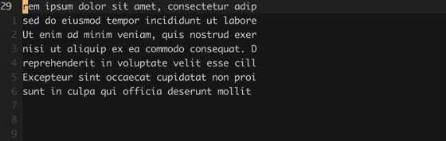

Toggle quotes on the current line or a visual selection with <kbd>[\<PREFIX\>](#gmkdxsettingsmapprefix)</kbd><kbd>'</kbd>.

```viml
" :h mkdx-mapping-toggle-quote
" :h mkdx-function-toggle-quote
```

## Wrap as link

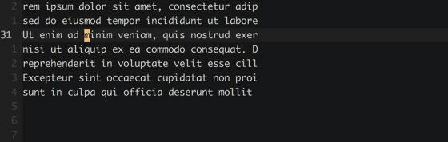

Wrap the word under the cursor or a visual selection in an empty markdown link
with <kbd>[\<PREFIX\>](#gmkdxsettingsmapprefix)</kbd><kbd>l</kbd><kbd>n</kbd>. You'll end up in **insert** mode with your
cursor between the parens, e.g. `(|)` where the pipe (`|`) character is the cursor.

If what you're wrapping is an image (only works with visual selections at the moment), an image link will be created
instead. To disable this behaviour, see: [`g:mkdx#settings.image_extension_pattern`](#gmkdxsettingsimage_extension_pattern).

```viml
" :h mkdx-mapping-wrap-text-in-link
" :h mkdx-function-wrap-link
```

## Wrap as bold / italic / inline-code / strikethrough

**Normal mode**


**Visual mode**
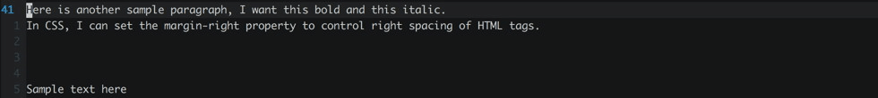

Wrap the word (anywhere) under the cursor or a visual selection using the following mappings:

- <kbd>[\<PREFIX\>](#gmkdxsettingsmapprefix)</kbd><kbd>/</kbd> => *italic*
- <kbd>[\<PREFIX\>](#gmkdxsettingsmapprefix)</kbd><kbd>b</kbd> => **bold**
- <kbd>[\<PREFIX\>](#gmkdxsettingsmapprefix)</kbd><kbd>\`</kbd> => `inline code`
- <kbd>[\<PREFIX\>](#gmkdxsettingsmapprefix)</kbd><kbd>s</kbd> => <strike>strikethrough</strike>

As with all other mappings, all the *normal* mode mappings are repeatable.

## Convert CSV to table (and back)

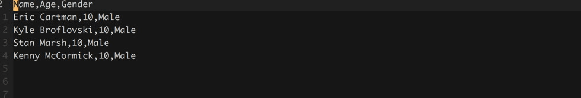

Convert visually selected CSV rows to a markdown table with <kbd>[\<PREFIX\>](#gmkdxsettingsmapprefix)</kbd><kbd>,</kbd>.
The first row will be used as a header. A separator will be inserted below the header. Default and specific column alignment options are also available, see: [`g:mkdx#settings.table.align`](#gmkdxsettingstablealign) for more.
The divider (`|`) as well as the header divider (`-`) can be changed with [`g:mkdx#settings.table.divider`](#gmkdxsettingstabledivider)
and [`g:mkdx#settings.table.header_divider`](#gmkdxsettingstableheader_divider). The above example contains a simple unqouted example but as of version _1.4.2_, quoted CSV is also supported.

```viml
" :h mkdx-mapping-csv-to-markdown-table
" :h mkdx-setting-table-align
" :h mkdx-setting-table-divider
" :h mkdx-setting-table-header-divider
" :h mkdx-function-tableize
```

## Jump to header

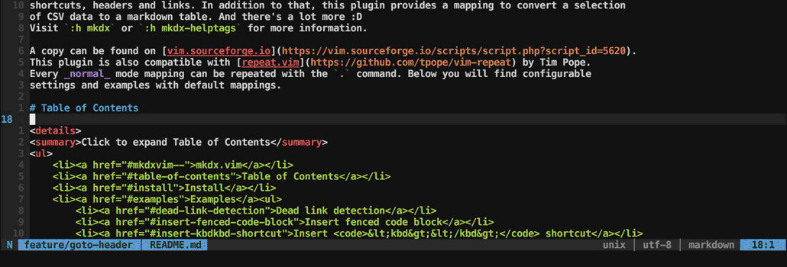

Press <kbd>[\<PREFIX\>](#gmkdxsettingsmapprefix)</kbd><kbd>j</kbd> to jump to a fragment identifier within the document.
Every link starting with a `#` symbol is considered a fragment identifier. both **markdown** and **HTML** are supported.
Before performing a jump, the current cursor position will be added to the jumplist (`:h jumplist`).
This allows you to jump back and forth between that header and the selected link using <kbd>\`</kbd><kbd>\`</kbd>.
This behaviour can be disabled by overriding [`g:mkdx#settings.links.fragment.jumplist`](#gmkdxsettingslinksfragmentjumplist).

```viml
" :h mkdx-setting-links-fragment-jumplist
" :h mkdx-plug-jump-to-header
" :h mkdx-function-jump-to-header
" :h mkdx-mapping-jump-to-header
```

## Generate or update TOC

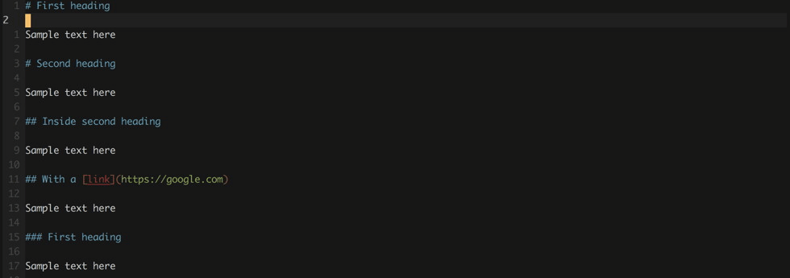

Press <kbd>[\<PREFIX\>](#gmkdxsettingsmapprefix)</kbd><kbd>i</kbd> to insert a table of contents
at cursor position if one does not exist, otherwise updates the existing TOC.
the text used in the heading can be changed using [`g:mkdx#settings.toc.text`](#gmkdxsettingstoctext) and the
list style can be changed using [`g:mkdx#settings.toc.list_token`](#gmkdxsettingstoclist_token).
Stuff inside fenced code blocks is excluded too.

If you want to place the TOC always as the _[N]th_ header, see [`g:mkdx#settings.toc.position`](#gmkdxsettingstocposition).

```viml
" :h mkdx-mapping-generate-or-update-toc
" :h mkdx-function-generate-toc
" :h mkdx-function-update-toc
" :h mkdx-function-generate-or-update-toc
```

## Generate or update TOC as `<details>`

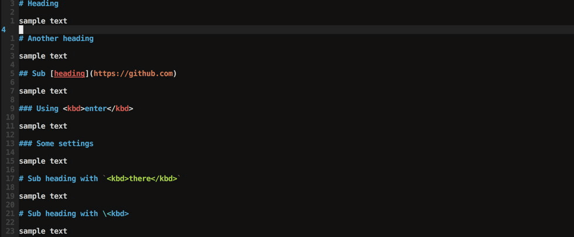

Github supports the `<details>` and `<summary>` tags! With these, we can make an expandable table of contents (like this README).
Unfortunately though, markdown isn't supported inside the `<details>` tag, not even with `markdown=1` (not from what I've tried anyway, let me know if you do!).
So instead the TOC itself will be rendered as HTML nested `<ul>` tags with `<li><a></a></li>` tags.

**NOTE:** This requires you to enable [`g:mkdx#settings.toc.details.enable`](#gmkdxsettingstocdetailsenable)!

<details>
<summary>Click to expand example</summary>
<ul>
<li><a href="">mkdx.vim</a></li>
<li><a href="">TOC</a></li>
<li><a href="">Install</a></li>
<li><a href="">Examples</a></li>
<li><a href="">Changelog</a><ul>
<li><a href="">31-03-2018 VERSION 1.1.0</a></li>
<li><a href="">25-03-2018 VERSION 1.0.2</a></li>
<li><a href="">24-03-2018 VERSION 1.0.1</a></li>
</ul></li>
</ul>
</details>
<br />

**Note:** When wrapping the TOC inside a details tag, you can optionally wrap nested items with a lot of children by using [g:mkdx#settings.toc.details.nesting_level](#gmkdxsettingstocdetailsnesting_level) and [g:mkdx#settings.toc.details.child_count](#gmkdxsettingstocdetailschild_count).
Check the [Table of Contents](#table-of-contents) for an example :)

## Open TOC in quickfix window


Press <kbd>[\<PREFIX\>](#gmkdxsettingsmapprefix)</kbd><kbd>I</kbd> to load all the markdown headers in a quickfix window.
You can jump around using regular quickfix commands afterwards, as shown in the gif using `:cn` for example.

```viml
" :h mkdx-mapping-quickfix-table-of-contents
" :h mkdx-function-quickfix-headers
```

## Open TOC using [fzf](https://github.com/junegunn/fzf.vim) instead of quickfix window

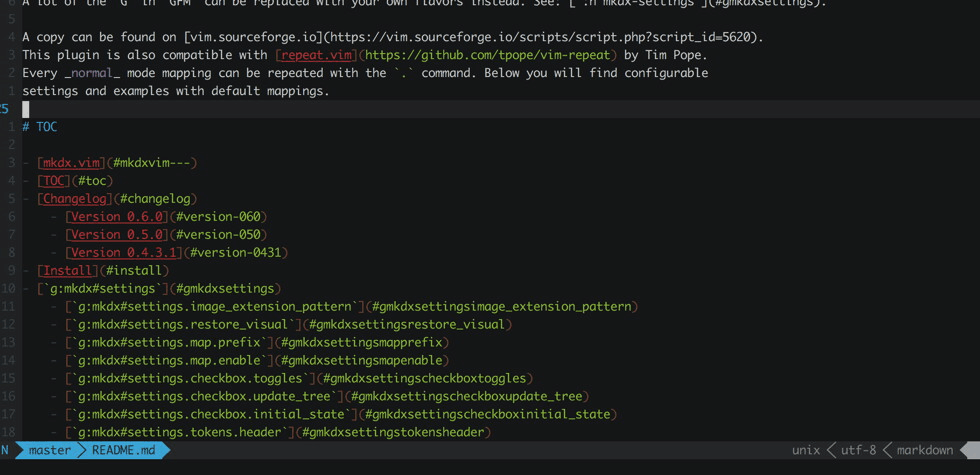

This is not built-in to the plugin but I just thought "why not, I'd use that".
So I started working on a little snippet in my [vimrc](https://github.com/SidOfc/dotfiles/blob/76393e2881c5577a316698eafb73c7dae36984bd/.vimrc#L340-L359) (included some comments here):

```viml
fun! s:MkdxGoToHeader(header)
    " given a line: '  84: # Header'
    " this will match the number 84 and move the cursor to the start of that line
    call cursor(str2nr(get(matchlist(a:header, ' *\([0-9]\+\)'), 1, '')), 1)
endfun

fun! s:MkdxFormatHeader(key, val)
    let text = get(a:val, 'text', '')
    let lnum = get(a:val, 'lnum', '')

    " if the text is empty or no lnum is present, return the empty string
    if (empty(text) || empty(lnum)) | return text | endif

    " We can't jump to it if we dont know the line number so that must be present in the outpt line.
    " We also add extra padding up to 4 digits, so I hope your markdown files don't grow beyond 99.9k lines ;)
    return repeat(' ', 4 - strlen(lnum)) . lnum . ': ' . text
endfun

fun! s:MkdxFzfQuickfixHeaders()
    " passing 0 to mkdx#QuickfixHeaders causes it to return the list instead of opening the quickfix list
    " this allows you to create a 'source' for fzf.
    " first we map each item (formatted for quickfix use) using the function MkdxFormatHeader()
    " then, we strip out any remaining empty headers.
    let headers = filter(map(mkdx#QuickfixHeaders(0), function('<SID>MkdxFormatHeader')), 'v:val != ""')

    " run the fzf function with the formatted data and as a 'sink' (action to execute on selected entry)
    " supply the MkdxGoToHeader() function which will parse the line, extract the line number and move the cursor to it.
    call fzf#run(fzf#wrap(
            \ {'source': headers, 'sink': function('<SID>MkdxGoToHeader') }
          \ ))
endfun

" finally, map it -- in this case, I mapped it to overwrite the default action for toggling quickfix (<PREFIX>I)
nnoremap <silent> <Leader>I :call <SID>MkdxFzfQuickfixHeaders()<Cr>
```

## Using the menu

The plugin comes with builtin `menu` support if your vim `has('menu')`.
The menu will become available _after_ you've opened a file with a **filetype** of `markdown`.
Actions can be executed from the menu in MacVim. More information about each mapping can be found in the Vim / Neovim versions.

|MacVim|NeoVim / Vim|
|------|------------|
|||

To view the menu in NeoVim / Vim, run (_after_ opening a markdown file):

```viml
" :h mkdx-menu
:menu Plugin.mkdx
```

# `g:mkdx#settings`

All the settings used in mkdx are defined in a `g:mkdx#settings` hash.
If you still have other `g:mkdx#` variables in your _.vimrc_, they should be replaced with an entry in `g:mkdx#settings` instead.
Going forward, no new `g:mkdx#` variables will be added, **only** `g:mkdx#settings` will be extended.
To see a mapping of new settings from old variables, see [this README](https://github.com/SidOfc/mkdx/blob/1a80ab700e6a02459879a8fd1e9e26ceca4f52c4/README.md#gmkdxsettings).

```viml
" :h mkdx-settings
let g:mkdx#settings = {
      \ 'image_extension_pattern': 'a\?png\|jpe\?g\|gif',
      \ 'restore_visual':          1,
      \ 'enter':                   { 'enable': 1, 'malformed': 1, 'o': 1,
      \                              'shifto': 1, 'shift': 0 },
      \ 'map':                     { 'prefix': '<leader>', 'enable': 1 },
      \ 'tokens':                  { 'enter': ['-', '*', '>'],
      \                              'bold': '**', 'italic': '*', 'strike': '',
      \                              'list': '-', 'fence': '',
      \                              'header': '#' },
      \ 'checkbox':                { 'toggles': [' ', '-', 'x'],
      \                              'update_tree': 2,
      \                              'initial_state': ' ' },
      \ 'toc':                     { 'text': "TOC", 'list_token': '-',
      \                              'update_on_write': 0,
      \                              'position': 0,
      \                              'details': {
      \                                 'enable': 0,
      \                                 'summary': 'Click to expand {{toc.text}}',
      \                                 'nesting_level': -1,
      \                                 'child_count': 5,
      \                                 'child_summary': 'show {{count}} items'
      \                              }
      \                            },
      \ 'table':                   { 'divider': '|',
      \                              'header_divider': '-',
      \                              'align': {
      \                                 'left':    [],
      \                                 'center':  [],
      \                                 'right':   [],
      \                                 'default': 'center'
      \                              }
      \                            },
      \ 'links':                   { 'external': {
      \                                 'enable': 0, 'timeout': 3, 'host': '', 'relative': 1,
      \                                 'user_agent':  'Mozilla/5.0 (Macintosh; Intel Mac OS X 10_13_1) AppleWebKit/537.36 (KHTML, like Gecko) Chrome/9001.0.0000.000 vim-mkdx/1.9.1'
      \                              },
      \                              'fragment': {
      \                                 'jumplist': 1,
      \                                 'complete': 1
      \                              }
      \                            },
      \ 'highlight':               { 'enable': 0 },
      \ 'auto_update':             { 'enable': 0 }
    \ }
```

To overwrite a setting, write it as seen above in your _.vimrc_:

```viml
" :h mkdx-settings
let g:mkdx#settings = { 'enter': { 'enable': 0 } }
```

Will disable the [`g:mkdx#settings.enter.enable`](#gmkdxsettingsenterenable) setting.
For backwards compatibility, `g:mkdx#` variables are merged into the defaults.
This happens before any `g:mkdx#settings` hash defined in _.vimrc_ is merged with the defaults.
So while `g:mkdx#` variables still work, they are overwritten when you explicitly define them in
a `g:mkdx#settings` variable.

Settings defined in _.vimrc_ are merged with the defaults during initial loading of the plugin.
To overwrite a setting while editing:

```viml
" :h mkdx-settings
:let g:mkdx#settings.enter.enable = 0
```

## `g:mkdx#settings.links.external.enable`

Check external links in the background is disabled by default.
HTTP requests will be sent using a `curl` command with the following layout:

```sh
curl -L -I -s --no-keepalive -o /dev/null -A [g:mkdx#settings.links.external.user_agent] -m [g:mkdx#settings.links.external.timeout] -w "%{http_code}" [URL]'
```

As can be seen from the example two additional settings are used in this request:

- `-m` gets set to [`g:mkdx#settings.links.external.timeout`](#gmkdxsettingslinksexternaltimeout)
- `-A` gets set to [`g:mkdx#settings.links.external.user_agent`](#gmkdxsettingslinksexternaluser_agent)

When a relative URL is encountered, mkdx attempts to convert it to an absolute path.
This only works inside a `git` repository at the moment, `git ls-remote` output will be used to do the conversion.
You can override this behaviour by setting a custom host with [`g:mkdx#settings.links.external.host`](#gmkdxsettingslinksexternalhost).
Relative link checking can be disabled all together by setting [`g:mkdx#settings.links.external.relative`](#gmkdxsettingslinksexternalrelative) to `0`;

```viml
" :h mkdx-setting-links-external-enable
let g:mkdx#settings = { 'links': { 'external': { 'enable': 0 } } }
```

## `g:mkdx#settings.links.external.timeout`

This is the maximum time in seconds a request may take. By default it is set to `3`. After this time, the request is cancelled and added to the quickfix list.

```viml
" :h mkdx-setting-links-external-timeout
let g:mkdx#settings = { 'links': { 'external': { 'timeout': 3 } } }
```

## `g:mkdx#settings.links.external.host`

When a host is supplied, mkdx will not attempt to do `git ls-remote` detection and instead, prepends host string provided to any absolute or relative link url.
Since these links can either be _relative_ (url) or _absolute_ (/url) some additional checks are executed to prevent double slashes e.g: `localhost:3000//url`.
Therefore you can safely append or remove a trailing `/` from your host.

As an example, say you have the following markdown link in your README.md file:

```markdown
See [CONTRIBUTING](/CONTRIBUTING.md)
```

The `git ls-remote` command will be executed to construct a base for the relative link. both SSH and HTTP hosts are parsed to a base URL.
Additionally, when constructing the base, we need to know the current branch since for example, github appends `blob/[BRANCHNAME]` to every URL as well.
To extract this information, a `git branch` command is run.
The output link will look like this:

```html
See <a href="https://github.com/sidofc/mkdx/blob/master/CONTRIBUTING.md">CONTRIBUTING</a>
```

If you're running a static site generator and would like to know if every link works, you can set it like so:

```viml
:let g:mkdx#settings.links.external.host = 'localhost:5000'
```

Using the same link as an example, the output link will instead, look like this:

```html
See <a href="http://localhost:5000/CONTRIBUTING.md">CONTRIBUTING</a>
```

The host can be changed at any given time during runtime, the next time a dead link check is run, the new host will be used instead.

```viml
" :h mkdx-setting-links-external-host
let g:mkdx#settings = { 'links': { 'external': { 'host': '' } } }
```

## `g:mkdx#settings.links.external.relative`

When set to `0`, relative links will be ignored while checking the document for dead links.
Relative URL's are defined as link paths that do not start with a `#` (fragment URL) or `http` (protocol).
Therefore both _relative_ (url) and _absolute_ (/url) URL's are "relative" in this context, as no host is provided.
When [`g:mkdx#settings.links.external.host`](#gmkdxsettingslinksexternalhost) is empty, mkdx attempts to construct an absolute path using `git ls-remote` output.

```viml
" :h mkdx-setting-links-external-relative
let g:mkdx#settings = { 'links': { 'external': { 'relative': 1 } } }
```

## `g:mkdx#settings.links.external.user_agent`

Specify an actual user agent to prevent being blocked from a website.
If you don't like being `Chrome/9001` then feel free to change it into anything you like :)

```viml
" :h mkdx-setting-links-external-ua
let g:mkdx#settings = { 'links': { 'external': { 'user_agent': 'Mozilla/5.0 (Macintosh; Intel Mac OS X 10_13_1) AppleWebKit/537.36 (KHTML, like Gecko) Chrome/9001.0.0000.000 vim-mkdx/1.9.1' } } }
```

## `g:mkdx#settings.links.fragment.jumplist`

Specify wether or not to add the cursor position _before jumping_ to the jumplist (`:h jumplist`).
This setting is enabled by default, set it to `0` to disable.

```viml
" :h mkdx-setting-links-fragment-jumplist
" :h mkdx-function-jump-to-header
" :h mkdx-plug-jump-to-header
let g:mkdx#settings = { 'links': { 'fragment': { 'jumplist': 1 } } }
```

## `g:mkdx#settings.links.fragment.complete`

Autocomplete fragment links in [_insert_ mode](#insert-mode-fragment-completion).
Set to `0` to disable, [`g:mkdx#settings.map.enable`](#gmkdxsettingsmapenable) must be enabled for <kbd>ctrl</kbd>+<kbd>n</kbd> and <kbd>ctrl</kbd>+<kbd>p</kbd> to be mapped.

This setting is [auto updated](#gmkdxsettingsauto_updateenable) when available.

```viml
" :h mkdx-setting-links-fragment-complete
let g:mkdx#settings = { 'links': { 'fragment': { 'complete': 1 } } }
```

## `g:mkdx#settings.image_extension_pattern`

Defines the extensions to search for when identifying the type of link that
will be generated when [wrapping text in a link](#wrap-as-link). Setting it to an empty string
disables image wrapping and a regular empty markdown link will be used instead.

```viml
" :h mkdx-setting-image-extension-pattern
let g:mkdx#settings = { 'image_extension_pattern': 'a\?png\|jpe\?g\|gif' }
```

## `g:mkdx#settings.restore_visual`

This setting enables the restoration of the last visual selection after performing an action in visual mode:

```viml
" :h mkdx-setting-restore-visual
let g:mkdx#settings = { 'restore_visual': 1 }
```

## `g:mkdx#settings.map.prefix`

All mappings are prefixed with a single prefix key.
If a mapping contains <kbd>[\<PREFIX\>](#gmkdxsettingsmapprefix)</kbd> key, it is the value of this variable.
If you do not like the default (`<leader>`) you can override it:

```viml
" :h mkdx-setting-map-prefix
let g:mkdx#settings = { 'map': { 'prefix': '<leader>' } }
```

## `g:mkdx#settings.map.enable`

If you'd rather full control over what is mapped, you can opt-out all together by setting it to `0`.
Note: that the plugin checks if a keybind exists before creating it. Mappings defined in your _.vimrc_ will not be overwritten.

```viml
" :h mkdx-setting-map-enable
let g:mkdx#settings = { 'map': { 'enable': 1 } }
```

## `g:mkdx#settings.checkbox.toggles`

Defines the list of states to use when toggling a checkbox.
It can be set to a list of your choosing. Special characters must be escaped!
Also, the list of toggles **must** contain at the very least, 2 items!

```viml
" :h mkdx-setting-checkbox-toggles
let g:mkdx#settings = { 'checkbox': { 'toggles': [' ', '-', 'x'] } }

" GFM supported list (e.g. on GitHub)
let g:mkdx#settings = { 'checkbox': { 'toggles': [' ', 'x'] } }
```

## `g:mkdx#settings.checkbox.update_tree`

With this setting on, checkboxes that are toggled within checklists (lists of checkboxes) cause parent and child list items
to be updated automatically. The states from [`g:mkdx#settings.checkbox.toggles`](#gmkdxsettingscheckboxtoggles) are used to check and
update the statusses of any parents. Children are force updated to the same token of their parent. To disable this behaviour
entirely, set this value to `0`. If you do not want children to be updated, set this value to `1` instead.

```viml
" :h mkdx-setting-checkbox-update-tree
let g:mkdx#settings = { 'checkbox': { 'update_tree': 2 } }
```

## `g:mkdx#settings.checkbox.initial_state`

When toggling between checkbox/checklist lines, this defines
what the default value of each inserted checkbox should be.

```viml
" :h mkdx-setting-checkbox-initial-state
let g:mkdx#settings = { 'checkbox': { 'initial_state': ' ' } }
```

## `g:mkdx#settings.tokens.header`

If you want to use a different style for markdown headings (h1, h2, etc...).

This setting is [auto updated](#gmkdxsettingsauto_updateenable) when available.

```viml
" :h mkdx-setting-tokens-header
let g:mkdx#settings = { 'tokens': { 'header': '#' } }
```
## `g:mkdx#settings.tokens.enter`

Used by [`g:mkdx#settings.enter.enable`](#gmkdxsettingsenterenable). This is the list of tokens that are supported by default.
Since numbers are handled differently, they are not included in this list but they are supported.

```viml
" :h mkdx-setting-tokens-enter
let g:mkdx#settings = { 'tokens': { 'enter': ['-', '*', '>'] } }
```

## `g:mkdx#settings.tokens.fence`

Defines the fencing style to use when [inserting a fenced code block](#insert-fenced-code-block).
By default it is set to an empty string, in which case typing tildes will result in a fenced code block
using tildes and typing backticks results in a code block using backticks.

This value can be set to a `` ` `` or a `~` character. When set, the same style will always be used for
fenced code blocks.

This setting is [auto updated](#gmkdxsettingsauto_updateenable) when available.

```viml
" :h mkdx-setting-tokens-fence
let g:mkdx#settings = { 'tokens': { 'fence': '' } }
```

## `g:mkdx#settings.tokens.italic`

This token is used for italicizing the current word under the cursor or a visual selection of text.
See [this section](#wrap-as-bold--italic--inline-code--strikethrough) for more details.

```viml
" :h mkdx-setting-tokens-italic
let g:mkdx#settings = { 'tokens': { 'italic': '*' } }
```

## `g:mkdx#settings.tokens.bold`

This token is used for bolding the current word under the cursor or a visual selection of text.
See [this section](#wrap-as-bold--italic--inline-code--strikethrough) for more details.

## `g:mkdx#settings.tokens.strike`

This token is used for striking the current word under the cursor or a visual selection of text.
See [this section](#wrap-as-bold--italic--inline-code--strikethrough) for more details.

**Note:** this setting has been added in version *1.7.0*. Prior to that,
`<strike>...</strike>` tags will always be used to create strikethrough text.

```viml
" :h mkdx-setting-tokens-bold
let g:mkdx#settings = { 'tokens': { 'bold': '**' } }
```

## `g:mkdx#settings.tokens.list`

This token defines what list markers should be inserted when toggling list /
checklist items.

```viml
" :h mkdx-setting-tokens-list
let g:mkdx#settings = { 'tokens': { 'list': '-' } }
```

## `g:mkdx#settings.table.header_divider`

Change the separator used for table headings in markdown tables.

```viml
" :h mkdx-setting-table-header-divider
let g:mkdx#settings = { 'table': { 'header_divider': '-' } }
```

## `g:mkdx#settings.table.divider`

You can also change the separator used in markdown tables.

```viml
" :h mkdx-setting-table-divider
let g:mkdx#settings = { 'table': { 'divider': '|' } }
```

## `g:mkdx#settings.table.align`

Control the alignment of content within table columns.
Its value is a dictionary with keys `center`, `left`, `right` and `default`.
The `default` value is used when a column name is not found in any of the `center`, `left` or `right` lists.

```viml
  {
    \ 'left':    [],
    \ 'center':  [],
    \ 'right':   [],
    \ 'default': 'center'
\ }
```

If you were to add `name` to the `left` list, e.g. `{ 'left': ['name'] }` and the first row of your CSV has a column with the content `name`, that column will be _left aligned_ (`|:----|`).
Any other column would be _centered_ (`|:---:|`) because they do not appear in any list so the `default` value `'center'` is used.

```viml
" :h mkdx-setting-table-align
let g:mkdx#settings = { 'table': { 'align': {
        \ 'left':    [],
        \ 'center':  [],
        \ 'right':   [],
        \ 'default': 'center' } } }
```

## `g:mkdx#settings.enter.shift`

When enabled, pressing <kbd>shift</kbd>+<kbd>enter</kbd> will indent the next line upto the level of the text on the current line.
No list tokens will be prepended. This is useful when you want to write a multi-line list item and want to start at the correct indentation level.
For example, given this list (cursor indicated by a "`|`" character):

```markdown
- [ ] a list item
- [ ] a list item|
- [ ] a list item
```

Pressing <kbd>shift</kbd>+<kbd>enter</kbd> will produce:

```markdown
- [ ] a list item
- [ ] a list item
      |
- [ ] a list item
```

This works for any list type supported by mkdx. When <kbd>shift</kbd>+<kbd>enter</kbd> is pressed while not at the end of the line,
the text after the cursor position is carried over to the next line at the correct indentation.

**Note**: this setting is _disabled_ by default due to the sketchy handling of <kbd>shift</kbd>+<kbd>enter</kbd> in different terminal emulators.
Some emulators send the same codes for <kbd>enter</kbd> and <kbd>shift</kbd>+<kbd>enter</kbd> which means (n)vim cannot distinguish one from another.
This can usually be fixed by setting them manually for your emulator, included from this [SO answer](https://stackoverflow.com/a/42461580/2224331):

> I managed to correct my terminal key-code for <kbd>Shift</kbd>+<kbd>Enter</kbd>
> by sending the key-code Vim apparently expects. Depending on your terminal,
> _(Adding <kbd>Ctrl</kbd>+<kbd>Enter</kbd> as a bonus!)_
>
> **[iTerm2](https://www.iterm2.com/)**, open _Preferences_ → _Profiles_ → _Keys_ → _[+] (Add)_ →
> - _Keyboard shortcut:_ (Hit <kbd>Shift</kbd>+<kbd>Enter</kbd>)
> - _Action:_ _Send Escape Sequence_
> - _Esc+_ `[[13;2u`
>   Repeat for <kbd>Ctrl</kbd>+<kbd>Enter</kbd>, with sequence: `[[13;5u`
>
> **[urxvt](http://software.schmorp.de/pkg/rxvt-unicode.html)**, append to your `.Xresources` file:
>
>     URxvt.keysym.S-Return:     \033[13;2u
>     URxvt.keysym.C-Return:     \033[13;5u
>
> **[Alacritty](https://github.com/jwilm/alacritty)**, under `key_bindings`, add following to your `~/.config/alacritty/alacritty.yml`:
>
>     - { key: Return,   mods: Shift,   chars: "\x1b\[13;2u" }
>     - { key: Return,   mods: Control, chars: "\x1b\[13;5u" }

```viml
" :h mkdx-setting-enter-shift
" :h mkdx-function-shift-enter-handler
:let g:mkdx#settings = { 'enter': { 'shift': 0 } }
```

## `g:mkdx#settings.enter.enable`

This setting enables auto-appending list items when you are editing a markdown list.
When <kbd>enter</kbd> is pressed, a function is executed to detect wether or not to insert a new list item
or just do a regular enter. unordered lists and numbered lists are both handled correctly.

**NOTE:** When this setting is enabled, mkdx will execute a `setlocal formatoptions-=r` to prevent duplicate list markers from being inserted.
This setting is [auto updated](#gmkdxsettingsauto_updateenable) when available.

```viml
" :h mkdx-setting-enter-enable
let g:mkdx#settings = { 'enter': { 'enable': 1 } }
```

## `g:mkdx#settings.enter.o`

This setting overwrites normal mode `o` in markdown files and causes `o` to work like pressing `<enter>` at the end of the line
this means that lists, checklists, checkboxes, quotes etcetera are also inserted when pressing `o` in normal mode in addition to `<enter>` in insert mode.
Note that [`g:mkdx#settings.enter.enable`](#gmkdxsettingsenterenable) must be `1` for this to work.

```viml
" :h mkdx-setting-enter-o
let g:mkdx#settings = { 'enter': { 'o': 1 } }
```

## `g:mkdx#settings.enter.shifto`

This setting enables `O` in normal mode to prepend list items above the current line, your cursor will be placed after the newly added item.
Like [`g:mkdx#settings.enter.o`](#gmkdxsettingsentero), checkboxes are also added if they are present on the cursor line.
Note that [`g:mkdx#settings.enter.enable`](#gmkdxsettingsenterenable) must be `1` for this to work.

```viml
" :h mkdx-setting-enter-shifto
let g:mkdx#settings = { 'enter': { 'shifto': 1 } }
```

## `g:mkdx#settings.enter.malformed`

This setting defines behaviour to use when working with improperly indented
markdown lists. At the moment it works for checklist items that do not have an
`indent()` which is divisible by `shiftwidth`. In which case the indent will
be rounded up to the next indent if it is greater than `s:sw() / 2` otherwise it
will be rounded down to the previous indent.

```viml
" :h mkdx-setting-enter-malformed
let g:mkdx#settings = { 'enter': { 'malformed': 1 } }
```

## `g:mkdx#settings.toc.text`

Defines the text to use for the table of contents header itself.

This setting is [auto updated](#gmkdxsettingsauto_updateenable) when available.
```viml
" :h mkdx-setting-toc-text
let g:mkdx#settings = { 'toc': { 'text': 'TOC' } }
```

## `g:mkdx#settings.toc.list_token`

Defines the list token to use in the generated TOC.

```viml
" :h mkdx-setting-toc-list-token
let g:mkdx#settings = { 'toc': { 'list_token': '-' } }
```

## `g:mkdx#settings.toc.update_on_write`

As easy as it is to update the table of contents manually, [it is just as easy to forget](https://github.com/SidOfc/mkdx/search?q=update+toc&type=Commits) :)
This setting is disabled by default, set it to `1` to enable it and never worry about updating your TOC ever again.
When the TOC hasn't yet been generated and [`g:mkdx#settings.toc.position`](#gmkdxsettingstocposition) isn't `0`, the TOC will be generated at given position (or as the last header of the document if there aren't enough headers).
Otherwise, you will first have to generate the TOC once manually in the desired position and then it will be updated too.

**Note:** this only works if your vim `has('autocmd')`.

```viml
" :h mkdx-setting-toc-update-on-write
let g:mkdx#settings = { 'toc': { 'save_on_write': 0 } }
```

## `g:mkdx#settings.toc.position`

The position at which to place the TOC, `0` is used for cursor.
If a number `> 0` is supplied, the TOC will be generated ABOVE that header.
e.g. setting it to `1` will cause it to be the first heading of your document.

This setting is [auto updated](#gmkdxsettingsauto_updateenable) when available.

```viml
" :h mkdx-setting-toc-position
let g:mkdx#settings = { 'toc': { 'position': 0 } }
```

## `g:mkdx#settings.toc.details.enable`

This setting controls wether the generated TOC will be output as a regular _markdown_ list or inside a `<details>` tag.
See: [Generate or update TOC as `<details>`](#generate-or-update-toc-as-details) for an example.
By default, this option is disabled. To use it, set it's value to `1` instead.

This setting is [auto updated](#gmkdxsettingsauto_updateenable) when available.

```viml
" :h mkdx-setting-toc-details-enable
let g:mkdx#settings = { 'toc': { 'details': { 'enable': 0 } } }
```

## `g:mkdx#settings.toc.details.summary`

With [`g:mkdx#settings.toc.details.enable`](#gmkdxsettingstocdetailsenable) set to `1`, a `<summary>` tag will also be
generated inside the resulting `<details>` tag. This tag contains the text that will be displayed next to the "▶".
The default value has a special placeholder `{{toc.text}}`. This will be replaced with the value of [`g:mkdx#settings.toc.text`](#gmkdxsettingstoctext) upon generation.

This setting is [auto updated](#gmkdxsettingsauto_updateenable) when available.

```viml
" :h mkdx-setting-toc-details-summary
let g:mkdx#settings = { 'toc': { 'details': { 'summary': 'Click to expand {{toc.text}}' } } }
```

## `g:mkdx#settings.toc.details.nesting_level`

Disabled by default. This setting allows additional `<details>` to be generated from a specified nesting level. When enabled,
it relies on a TOC wrapped as details to already be present or [g:mkdx#settings.toc.details.enable](#gmkdxsettingstocdetailsenable) to be `1`.

Note: `1` is always added to the specified amount, this is to prevent all H1's from being wrapped when setting this value to `0`.
This means that a nesting level of `5` wraps H6 list items. Think of this value as the 'nth' nesting level, where 0 would make no sense to 'nest' since it is at the root of the list.

This setting is [auto updated](#gmkdxsettingsauto_updateenable) when available.

```viml
" :h mkdx-setting-toc-details-nesting-level
let g:mkdx#settings = { 'toc': { 'details': { 'nesting_level': -1 } } }
```

## `g:mkdx#settings.toc.details.child_count`

When [g:mkdx#settings.toc.details.nesting_level](#gmkdxsettingstocdetailsnesting_level) is enabled, this setting defines
when to wrap children of a specific list item. This is done by counting the children and either wrapping when the amount
of items is greater than or equal to this setting.

This setting is [auto updated](#gmkdxsettingsauto_updateenable) when available.

```viml
" :h mkdx-setting-toc-details-child-count
let g:mkdx#settings = { 'toc': { 'details': { 'child_count': 5 } } }
```

## `g:mkdx#settings.toc.details.child_summary`

This setting is like [g:mkdx#settings.toc.details.summary](#gmkdxsettingstocdetailssummary) but applies to the nested details summary.
A special `{{count}}` placeholder can be used in the supplied string which will be replaced with the amount of list items wrapped in the details tag.

This setting is [auto updated](#gmkdxsettingsauto_updateenable) when available.

```viml
" :h mkdx-setting-toc-details-child-summary
let g:mkdx#settings = { 'toc': { 'details': { 'child_summary': 'show {{count}} items' } } }
```

## `g:mkdx#settings.highlight.enable`

This setting enables state-specific highlighting for checkboxes and tables.
The highlighting is linked to the `gitcommit*` family of highlight groups (and Comment for list items), full list:
If you want to change the highlighting groups, `link` them to different groups:

```viml
" :h mkdx-highlighting

" these are the defaults, defined by mkdx in after/syntax/markdown/mkdx.vim
highlight default link mkdxListItem Comment
highlight default link mkdxCheckboxEmpty gitcommitUnmergedFile
highlight default link mkdxCheckboxPending gitcommitBranch
highlight default link mkdxCheckboxComplete gitcommitSelectedFile

" to change the color of list items to the "jsOperator" group, one would write this in their vimrc:
highlight link mkdxListItem jsOperator
```

Note: syntax highlighting is opt-in _by default_. This means you must explicitly enable this feature to use it.
The reason behind this is that this plugin is not a syntax plugin and maybe you are already using one that does such a thing in a way that works better for you.
You can see it in action in the [Completing checkboxes / checklists](#completing-checkboxes--checklists) examples.

This setting is [auto updated](#gmkdxsettingsauto_updateenable) when available.

```viml
" :h mkdx-setting-highlight-enable
" :h mkdx-highlighting
let g:mkdx#settings = { 'highlight': { 'enable': 0 } }
```

## `g:mkdx#settings.auto_update.enable`

This setting controls wether or not to update the document after changing certain variables.
Currently, this only works if your vim `has('*dictwatcheradd')`.

The following settings are automatically updated:

- [`g:mkdx#settings.toc.text`](#gmkdxsettingstoctext)
- [`g:mkdx#settings.toc.position`](#gmkdxsettingstocposition)
- [`g:mkdx#settings.toc.details.enable`](#gmkdxsettingstocdetailsenable)
- [`g:mkdx#settings.toc.details.summary`](#gmkdxsettingstocdetailssummary)
- [`g:mkdx#settings.tokens.header`](#gmkdxsettingstokensheader)
- [`g:mkdx#settings.tokens.fence`](#gmkdxsettingstokensfence)
- [`g:mkdx#settings.enter.enable`](#gmkdxsettingsenterenable)
- [`g:mkdx#settings.fold.enable`](#gmkdxsettingsfoldenable)
- [`g:mkdx#settings.fold.components`](#gmkdxsettingsfoldcomponents)
- [`g:mkdx#settings.links.fragment.complete`](#gmkdxsettingslinksfragmentcomplete)
- [`g:mkdx#settings.highlight.enable`](#gmkdxsettingshighlightenable)

```viml
" :h mkdx-setting-auto-update-enable
let g:mkdx#settings = { 'auto_update': { 'enable': 1 } }
```

## `g:mkdx#settings.fold.enable`

Controls wether or not to fold fenced (<code>\`\`\`</code> / `~~~`) code blocks and / or the table of contents (when generated by mkdx).
Behaviour can be controlled using [`g:mkdx#settings.fold.components`](#gmkdxsettingsfoldcomponents). Folding is disabled by default, set it to `1` to enable it.

This setting is [auto updated](#gmkdxsettingsauto_updateenable) when available.

```viml
" :h mkdx-setting-fold-enable
:let g:mkdx#settings = { 'fold': { 'enable': 0 } }
```

## `g:mkdx#settings.fold.components`

Controls which components to fold when [`g:mkdx#settings.fold.enable`](#gmkdxsettingsfoldenable) is enabled.
Currently, two components can be folded, `'toc'` and `'fence'`. items can be added and removed from the list as needed.

This setting is [auto updated](#gmkdxsettingsauto_updateenable) when available.

```viml
" :h mkdx-setting-fold-components
:let g:mkdx#settings = { 'fold': { 'components': ['toc', 'fence'] } }
```

# Mappings

Mappings can be turned off all together with [`g:mkdx#settings.map.enable`](#gmkdxsettingsmapenable).
The plugin checks if a mapping exists before creating it. If it exists, it will not create the mapping.
In case a mapping that this plugin provides doesn't work, please check if you have it in your _.vimrc_.

The below list contains all mappings that mkdx creates by default. To remap functionality: [remapping functionality](#remapping-functionality).
To prevent mapping of a key from happening, see: [unmapping functionality](#unmapping-functionality-using-nop).

**Note:** _replace `-{n|v}` with just `-n` or `-v` when creating your own mappings_

|description|modes|mapping|Execute|
|----|----|-------|-------|
|Prev checkbox state|normal, visual|<kbd>[\<PREFIX\>](#gmkdxsettingsmapprefix)</kbd><kbd>-</kbd>|`<Plug>(mkdx-checkbox-prev-{n\|v})`|
|Next checkbox state|normal, visual|<kbd>[\<PREFIX\>](#gmkdxsettingsmapprefix)</kbd><kbd>=</kbd>|`<Plug>(mkdx-checkbox-next-{n\|v})`|
|Promote header|normal|<kbd>[\<PREFIX\>](#gmkdxsettingsmapprefix)</kbd><kbd>\[</kbd>|`<Plug>(mkdx-promote-header)`|
|Demote header|normal|<kbd>[\<PREFIX\>](#gmkdxsettingsmapprefix)</kbd><kbd>\]</kbd>|`<Plug>(mkdx-demote-header)`|
|Toggle kbd shortcut|normal, visual|<kbd>[\<PREFIX\>](#gmkdxsettingsmapprefix)</kbd><kbd>k</kbd>|`<Plug>(mkdx-toggle-to-kbd-{n\|v})`|
|Toggle quote|normal, visual|<kbd>[\<PREFIX\>](#gmkdxsettingsmapprefix)</kbd><kbd>'</kbd>|`<Plug>(mkdx-toggle-quote-{n\|v})`|
|Toggle checkbox item|normal, visual|<kbd>[\<PREFIX\>](#gmkdxsettingsmapprefix)</kbd><kbd>t</kbd>|`<Plug>(mkdx-toggle-checkbox-{n\|v})`|
|Toggle checklist item|normal, visual|<kbd>[\<PREFIX\>](#gmkdxsettingsmapprefix)</kbd><kbd>l</kbd><kbd>t</kbd>|`<Plug>(mkdx-toggle-checklist-{n\|v})`|
|Toggle list item|normal, visual|<kbd>[\<PREFIX\>](#gmkdxsettingsmapprefix)</kbd><kbd>l</kbd><kbd>l</kbd>|`<Plug>(mkdx-toggle-list-{n\|v})`|
|Wrap link|normal, visual|<kbd>[\<PREFIX\>](#gmkdxsettingsmapprefix)</kbd><kbd>l</kbd><kbd>n</kbd>|`<Plug>(mkdx-wrap-link-{n\|v})`|
|Italicize text|normal, visual|<kbd>[\<PREFIX\>](#gmkdxsettingsmapprefix)</kbd><kbd>/</kbd>|`<Plug>(mkdx-mkdx-text-italic-{n\|v})`|
|Bolden text|normal, visual|<kbd>[\<PREFIX\>](#gmkdxsettingsmapprefix)</kbd><kbd>b</kbd>|`<Plug>(mkdx-mkdx-text-bold-{n\|v}))`|
|Wrap with inline code|normal, visual|<kbd>[\<PREFIX\>](#gmkdxsettingsmapprefix)</kbd><kbd>\`</kbd>|`<Plug>(mkdx-mkdx-text-inline-code-{n\|v})`|
|Wrap with strikethrough|normal, visual|<kbd>[\<PREFIX\>](#gmkdxsettingsmapprefix)</kbd><kbd>s</kbd>|`<Plug>(mkdx-mkdx-text-strike-{n\|v})`|
|CSV to table|visual|<kbd>[\<PREFIX\>](#gmkdxsettingsmapprefix)</kbd><kbd>,</kbd>|`<Plug>(mkdx-tableize)`|
|Jump to header|normal|<kbd>[\<PREFIX\>](#gmkdxsettingsmapprefix)</kbd><kbd>j</kbd>|`<Plug>(mkdx-jump-to-header)`|
|Generate / Update TOC|normal|<kbd>[\<PREFIX\>](#gmkdxsettingsmapprefix)</kbd><kbd>i</kbd>|`<Plug>(mkdx-gen-or-upd-toc)`|
|Quickfix TOC|normal|<kbd>[\<PREFIX\>](#gmkdxsettingsmapprefix)</kbd><kbd>I</kbd>|`<Plug>(mkdx-quickfix-toc)`|
|Quickfix dead fragment links|normal|<kbd>[\<PREFIX\>](#gmkdxsettingsmapprefix)</kbd><kbd>L</kbd>|`<Plug>(mkdx-quickfix-links)`|
|<kbd>o</kbd> handler|normal|<kbd>o</kbd>|`<Plug>(mkdx-o)`|
|<kbd>O</kbd> handler|normal|<kbd>O</kbd>|`<Plug>(mkdx-shift-o)`|
|Insert fenced code block|insert|<kbd>\`</kbd><kbd>\`</kbd><kbd>\`</kbd>|`<Plug>(mkdx-fence-backtick)`|
|Insert fenced code block|insert|<kbd>\~</kbd><kbd>\~</kbd><kbd>\~</kbd>|`<Plug>(mkdx-fence-tilde)`|
|Insert kbd shortcut|insert|<kbd>\<</kbd><kbd>tab</kbd>|`<Plug>(mkdx-insert-kbd)`|
|<kbd>enter</kbd> handler|insert|<kbd>enter</kbd>|`<Plug>(mkdx-enter)`|
|<kbd>shift</kbd>+<kbd>enter</kbd> handler|insert|<kbd>shift</kbd>+<kbd>enter</kbd>|`<Plug>(mkdx-shift-enter)`|
|<kbd>ctrl</kbd>+<kbd>n</kbd> handler|insert|<kbd>ctrl</kbd>+<kbd>n</kbd>|`<Plug>(mkdx-ctrl-n-compl)`|
|<kbd>ctrl</kbd>+<kbd>p</kbd> handler|insert|<kbd>ctrl</kbd>+<kbd>p</kbd>|`<Plug>(mkdx-ctrl-p-compl)`|
|<kbd>#</kbd> handler|insert|<kbd>#</kbd>|`<Plug>(mkdx-link-compl)`|

## Remapping functionality

`<Plug>` mappings can easily be remapped to any other key you prefer.
When a `<Plug>(mkdx-*)` mapping is found, mkdx will not create the default mapping for that `<Plug>`.
If you want to disable functionality, see: [Unmapping functionality](#unmapping-functionality-using-nop).

```viml
" this will remap <leader>q in every filetype, not very handy in most cases
nnoremap <leader>q <Plug>(mkdx-quickfix-toc)

" to keep it limited to markdown files, one can use an "autocommand".
" First, make sure we don't create the default mapping when entering markdown files.
" All plugs can be disabled like this (except insert mode ones, they need "imap" instead of "nmap").
nmap <Plug> <Plug>(mkdx-quickfix-toc)

" then create a function to remap manually
fun! s:MkdxRemap()
    " regular map family can be used since these are buffer local.
    nmap <buffer><silent> <leader>q <Plug>(mkdx-quickfix-toc)
    " other overrides go here
endfun

" finally, add a "FileType" autocommand that calls "s:MkdxRemap()" upon entering markdown filetype
augroup Mkdx
    au!
    au FileType markdown, mkdx call s:MkdxRemap()
augroup END
```

## Unmapping functionality using `<Nop>`

If you want to unmap specific functionality, you'll have to define a mapping for it.
This is required because the plugin maps its keys when opening a markdown file, so if you `unmap` something,
it will still get mapped to other markdown buffers. To disable any map, first find it [here](#mappings) or at: `:h mkdx-mappings`.

Say you want to disable toggling next checkbox state (mapped to <kbd>[\<PREFIX\>](#gmkdxsettingsmapprefix)</kbd><kbd>=</kbd>).
In your _.vimrc_, add the following:

```viml
" this will disable toggling checkbox next in normal mode.
nmap <leader>= <Nop>

" this will disable toggling checkbox next in visual mode.
vmap <leader>= <Nop>
```

The mappings are checked using the value of [`g:mkdx#settings.map.prefix`](#gmkdxsettingsmapprefix) so you may need to check its value first
by running the following: `:echo g:mkdx#settings.map.prefix`. A better way to prevent mkdx from mapping keys is by remapping `<Plug>` mappings.

## Unmapping functionality using `<Plug>`

If you don't know what a `<Plug>` is, it is a builtin tool for plugin authors to provide a more
"clear" and user-friendly plugin interface (and to create repeatable mappings with repeat.vim!).
All of the functions of mkdx are mapped using `<Plug>` mappings.
To disable a `<Plug>` mapping, first find it [here](#mappings) or at: `:h mkdx-plugs`.

Say you want to disable the behaviour for toggling the next checkbox state.
The corresponding `<Plug>` is called `<Plug>(mkdx-checkbox-next-n)`. To disable it, add the following to your _.vimrc_:

```viml
map <Plug> <Plug>(mkdx-checkbox-next-n)
```

# Supported `grep` programs

When your vim `has('job')` or `has('nvim')`, mkdx will look for a grep program, the following are recognized:

- [`rg`](https://github.com/BurntSushi/ripgrep)
- [`ag`](https://github.com/ggreer/the_silver_searcher)
- [`cgrep`](https://github.com/awgn/cgrep)
- [`ack`](https://github.com/beyondgrep/ack2)
- [`pt`](https://github.com/monochromegane/the_platinum_searcher)
- [`ucg`](https://github.com/gvansickle/ucg)
- [`sift`](https://github.com/svent/sift)
- `grep` / `ggrep`

The listed programs are searched in order, if a program is found, it will be used in [various](#insert-mode-fragment-completion) [different](#jump-to-header) places.
This will prevent your editor from freezing and it'll be blazing fast compared to the builtin Vimscript fallbacks.

# Contributing

Found a bug or want to report an issue? Take a look at the [CONTRIBUTING](CONTRIBUTING.md) file for more information.

# Roadmap

- Improve testing setup
- Cleanup of code
- Add more tests for all components

# Changelog

The latest changes will be visible in this list.
See [CHANGELOG.md](CHANGELOG.md) for older changes.

## 10-05-2019 VERSION 1.9.1

- Fix: Handle non-ascii characters in header (TOC) links ([#85](../../pull/85) by @totpet)

## 23-11-2018 VERSION 1.9.0

- Add: Table of contents supports configurable nested details tags
- Add: [g:mkdx#settings.toc.details.nesting_level](#gmkdxsettingstocdetailsnesting_level) to control nested details generation
- Add: [g:mkdx#settings.toc.details.child_count](#gmkdxsettingstocdetailschild_count) to control after how many children a nested details tag will appear
- Add: [g:mkdx#settings.toc.details.child_summary](#gmkdxsettingstocdetailschild_summary) to control summary text inside nested details

## 20-11-2018 VERSION 1.8.3

- Fix: handle unicode characters in list items ([#80](../../issues/80))
- Fix: handle unicode characters in CSV ([#81](../../issues/81))
