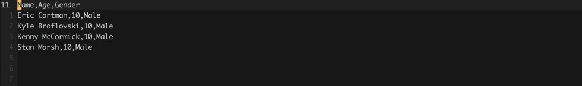

# mkdx.vim

mkdx.vim is a `markdown` plugin that aims to reduce the time you spend formatting your
markdown documents. It does this by adding some configurable mappings for files with a
markdown **filetype**. Functionality is included for toggling _checkboxes_,
_header levels_ and _quotes_ in addition to _wrapping text in a link_ and
_converting CSV data to a markdown table_. Visit `:h mkdx` or `:h mkdx-helptags` for
more information.

This plugin is also compatible with [repeat.vim](https://github.com/tpope/vim-repeat) by Tim Pope.
Every _normal_ mode mapping can be repeated with the `.` command.

## Table of Contents

- [Table of contents](#table-of-contents)
- [Variables](#variables)
  - [`g:mkdx#map_prefix`](#gmkdxmap_prefix)
  - [`g:mkdx#map_keys`](#gmkdxmap_keys)
  - [`g:mkdx#checkbox_toggles`](#gmkdxcheckbox_toggles)
  - [`g:mkdx#restore_visual`](#gmkdxrestore_visual)
  - [`g:mkdx#header_style`](#gmkdxheader_style)
  - [`g:mkdx#table_header_divider`](#gmkdxtable_header_divider)
  - [`g:mkdx#table_divider`](#gmkdxtable_divider)
  - [`g:mkdx#enhance_enter`](#gmkdxenhance_enter)
  - [`g:mkdx#list_tokens`](#gmkdxlist_tokens)
- [Examples and Mappings](#examples-and-mappings)
  - [List items](#list-items)
  - [Toggling checkboxes](#toggling-checkboxes)
  - [Toggling headers](#toggling-headers)
  - [Toggling Quotes](#toggling-quotes)
  - [Wrap text in link](#wrap-text-in-link)
  - [Convert CSV to table](#convert-csv-to-table)

## Variables

### `g:mkdx#map_prefix`

All mappings are prefixed with a single prefix key.
If a mapping contains <kbd>[\<PREFIX\>](#gmkdxmap_prefix)</kbd> key, it is the value of this variable.
If you do not like the default (`<leader>`) you can override it:

```viml
" :h mkdx-var-map-prefix
let g:mkdx#map_prefix = '<leader>'
```

### `g:mkdx#map_keys`

If you'd rather full control over what is mapped, you can opt-out all together by setting it to `0`.
**Note** that the plugin checks if a keybind exists before creating it. You can safely override every mapping this plugin sets.

```viml
" :h mkdx-var-map-keys
let g:mkdx#map_keys = 1
```

### `g:mkdx#checkbox_toggles`

This setting defines the list of states to use when toggling a checkbox.
It can be overridden by setting it to a list of your choosing. Note that special characters must be escaped!

```viml
" :h mkdx-var-checkbox-toggles
let g:mkdx#checkbox_toggles = [' ', '\~', 'x', '\!']
```

### `g:mkdx#restore_visual`

This setting enables the restoration of the last visual selection after performing an action in visual mode:

```viml
" :h mkdx-var-restore-visual
let g:mkdx#restore_visual = 1
```

### `g:mkdx#header_style`

If you want to use a different style for markdown headings (h1, h2, etc...).

```viml
" :h mkdx-var-header-style
let g:mkdx#header_style = '#'
```

### `g:mkdx#table_header_divider`

You can change the separator used for table headings in markdown tables.

```viml
" :h mkdx-var-table-header-divider
let g:mkdx#table_header_divider = '-'
```

### `g:mkdx#table_divider`

You can also change the separator used in markdown tables.

```viml
" :h mkdx-var-table-divider
let g:mkdx#table_divider = '|'
```
### `g:mkdx#enhance_enter`

This setting enables auto-appending list items when you are editing a markdown list.
When <kbd>enter</kbd> is pressed, a function is executed to detect wether or not to insert a new list item
or just do a regular enter. unordered lists and numbered lists are both handled correctly.

```viml
" :h mkdx-var-enhance-enter
let g:mkdx#enhance_enter = 1
```

### `g:mkdx#list_tokens`

Used by [`g:mkdx#enhance_enter`](#gmkdxenhance_enter). This is the list of tokens that are supported by default.
Since numbers are handled differently, they are not included in this list but they are supported.

```viml
" :h mkdx-var-list-tokens
let g:mkdx#list_tokens = ['-', '*', '>']
```

## Examples and Mappings

Mappings can be turned off all together with [`g:mkdx#map_keys`](#gmkdxmap_keys).
The plugin checks if a mapping exists before creating it. If it exists, it will not create the mapping.
In case a mapping that this plugin provides doesn't work, please check if you have it in your _.vimrc_.

### List items

|Unordered|Numbered|
|---------|--------|
|||

When [`g:mkdx#enhance_enter`](#gmkdxenhance_enter) is set (default on), new list tokens will be inserted when
editing a markdown list.

```viml
" :h mkdx-var-enhance-enter
" :h mkdx-var-list-tokens
" :h mkdx-function-enter-handler
```

### Toggling Checkboxes


Checkboxes can be toggled using <kbd>[\<PREFIX\>](#gmkdxmap_prefix)</kbd>+<kbd>=</kbd> and <kbd>[\<PREFIX\>](#gmkdxmap_prefix)</kbd>+<kbd>-</kbd>.
Toggling a checkbox means going to the previous or next mark in the list of [`g:mkdx#checkbox_toggles`](#gmkdxcheckbox_toggles).

```viml
" :h mkdx-mapping-toggle-checkbox-forward
" :h mkdx-mapping-toggle-checkbox-backward
" :h mkdx-function-toggle-checkbox
```

### Toggling Headers


Increment or decrement a heading with <kbd>[\<PREFIX\>](#gmkdxmap_prefix)</kbd>+<kbd>[</kbd> and <kbd>[\<PREFIX\>](#gmkdxmap_prefix)</kbd>+<kbd>]</kbd>.
These mappings cycle backward and forward between h1 and h6, wrapping around both ends.
The header character can be changed using [`g:mkdx#header_style`](#gmkdxheader_style).

```viml
" :h mkdx-mapping-increment-header-level
" :h mkdx-mapping-decrement-header-level
" :h mkdx-function-toggle-header
```

### Toggling Quotes


Toggle quotes on the current line or a visual selection with <kbd>[\<PREFIX\>](#gmkdxmap_prefix)</kbd>+<kbd>'</kbd>.

```viml
" :h mkdx-mapping-toggle-quote
" :h mkdx-function-toggle-quote
```

### Wrap text in link


Wrap the word under the cursor or a visual selection in an empty markdown link
with <kbd>[\<PREFIX\>](#gmkdxmap_prefix)</kbd>+<kbd>l</kbd><kbd>n</kbd>. You'll end up in **insert** mode with your
cursor between the parens, e.g. `(|)` where the pipe (`|`) character is the cursor.

```viml
" :h mkdx-mapping-expand-selection-to-link
" :h mkdx-function-wrap-link
```

### Convert CSV to table



Convert visually selected CSV rows to a markdown table with <kbd>[\<PREFIX\>](#gmkdxmap_prefix)</kbd>+<kbd>,</kbd>.
The first row will be used as a header.A separator will be inserted below the header.
The divider (`|`) as well as the header divider can be changed with [`g:mkdx#table_divider`](#gmkdxtable_divider)
and [`g:mkdx#table_header_divider`](#gmkdxtable_header_divider).

```viml
" :h mkdx-mapping-csv-to-markdown-table
" :h mkdx-function-tableize
```
