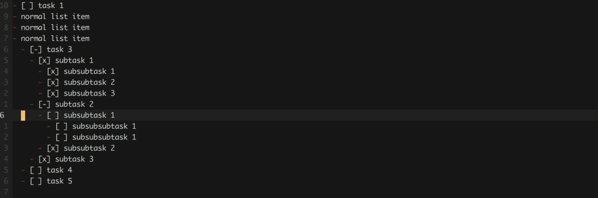
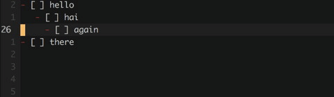

# mkdx.vim

**If this README is displayed incorrectly, please see the version on [github.com](https://github.com/SidOfc/mkdx).**

mkdx.vim is a `markdown` plugin that aims to reduce the time you spend formatting your
markdown documents. It does this by adding some configurable mappings for files with a
markdown **filetype**. Functions are included to handle lists, checkboxes (even lists of checkboxes!), fenced code blocks,
shortcuts, headers and links. In addition to that, this plugin provides a mapping to convert a selection
of CSV data to a markdown table. Visit `:h mkdx` or `:h mkdx-helptags` for more information.

A copy can be found on [vim.sourceforge.io](https://vim.sourceforge.io/scripts/script.php?script_id=5620).
This plugin is also compatible with [repeat.vim](https://github.com/tpope/vim-repeat) by Tim Pope.
Every _normal_ mode mapping can be repeated with the `.` command. Below you will find configurable
settings and examples with default mappings.

# TOC

- [mkdx.vim](#mkdxvim)
- [TOC](#toc)
- [Install](#install)
- [Variables](#variables)
    - [`g:mkdx#map_prefix`](#gmkdxmap_prefix)
    - [`g:mkdx#map_keys`](#gmkdxmap_keys)
    - [`g:mkdx#checkbox_toggles`](#gmkdxcheckbox_toggles)
    - [`g:mkdx#checklist_update_tree`](#gmkdxchecklist_update_tree)
    - [`g:mkdx#restore_visual`](#gmkdxrestore_visual)
    - [`g:mkdx#header_style`](#gmkdxheader_style)
    - [`g:mkdx#table_header_divider`](#gmkdxtable_header_divider)
    - [`g:mkdx#table_divider`](#gmkdxtable_divider)
    - [`g:mkdx#enhance_enter`](#gmkdxenhance_enter)
    - [`g:mkdx#list_tokens`](#gmkdxlist_tokens)
    - [`g:mkdx#fence_style`](#gmkdxfence_style)
    - [`g:mkdx#toc_text`](#gmkdxtoc_text)
    - [`g:mkdx#toc_list_token`](#gmkdxtoc_list_token)
    - [`g:mkdx#handle_malformed_indent`](#gmkdxhandle_malformed_indent)
    - [`g:mkdx#link_as_img_pat`](#gmkdxlink_as_img_pat)
    - [`g:mkdx#italic_token`](#gmkdxitalic_token)
    - [`g:mkdx#bold_token`](#gmkdxbold_token)
    - [`g:mkdx#list_token`](#gmkdxlist_token)
    - [`g:mkdx#checkbox_initial_state`](#gmkdxcheckbox_initial_state)
- [Mappings](#mappings)
- [Unmapping functionality](#unmapping-functionality)
- [Examples](#examples)
    - [Insert fenced code block](#insert-fenced-code-block)
    - [Insert `<kbd></kbd>` shortcut](#insert-kbdkbd-shortcut)
    - [List items](#list-items)
    - [Toggling lists, checklists or checkboxes](#toggling-lists-checklists-or-checkboxes)
        - [Checkboxes](#checkboxes)
        - [Lists](#lists)
        - [Checklists](#checklists)
    - [Checking Checkboxes / Checklists](#checking-checkboxes--checklists)
    - [Toggling Headers](#toggling-headers)
    - [Toggling Quotes](#toggling-quotes)
    - [Wrapping text](#wrapping-text)
        - [As a link](#as-a-link)
        - [As bold / italic / inline-code / strikethrough](#as-bold--italic--inline-code--strikethrough)
    - [Convert CSV to table](#convert-csv-to-table)
    - [Generate or update TOC](#generate-or-update-toc)
- [What's next?](#whats-next)
- [Contributing](#contributing)

# Install

This plugin should work in _vim_ as well as _nvim_, no clue about _gvim_ but since this plugin only manipulates
text and is written in vimL, it will probably work there too. To install, use a plugin manager of choice like
[Vundle](https://github.com/VundleVim/Vundle.vim) or [Pathogen](https://github.com/tpope/vim-pathogen).

**[Vundle](https://github.com/VundleVim/Vundle.vim)**
```viml
Plugin 'SidOfc/mkdx'

:so $MYVIMRC
:PluginInstall
```

**[NeoBundle](https://github.com/Shougo/neobundle.vim)**
```viml
NeoBundle 'SidOfc/mkdx'

:so $MYVIMRC
:NeoBundleInstall
```

**[vim-plug](https://github.com/junegunn/vim-plug)**
```viml
Plug 'SidOfc/mkdx'

:so $MYVIMRC
:PlugInstall
```

**[Pathogen](https://github.com/tpope/vim-pathogen)**
```sh
cd ~/.vim/bundle
git glone https://github.com/SidOfc/mkdx
```

# Variables

## `g:mkdx#map_prefix`

All mappings are prefixed with a single prefix key.
If a mapping contains <kbd>[\<PREFIX\>](#gmkdxmap_prefix)</kbd> key, it is the value of this variable.
If you do not like the default (`<leader>`) you can override it:

```viml
" :h mkdx-var-map-prefix
let g:mkdx#map_prefix = '<leader>'
```

## `g:mkdx#map_keys`

If you'd rather full control over what is mapped, you can opt-out all together by setting it to `0`.
**Note** that the plugin checks if a keybind exists before creating it. You can safely override every mapping this plugin sets.

```viml
" :h mkdx-var-map-keys
let g:mkdx#map_keys = 1
```

## `g:mkdx#checkbox_toggles`

This setting defines the list of states to use when toggling a checkbox.
It can be overridden by setting it to a list of your choosing. Note that special characters must be escaped!
Also, the list of toggles **must** contain at the very least, 3 items!
The reason for this is that [`g:mkdx#checklist_update_tree`](#gmkdxchecklist_update_tree) uses these
to be able to work with a user supplied list of toggles.

```viml
" :h mkdx-var-checkbox-toggles
let g:mkdx#checkbox_toggles = [' ', '-', 'x']
```

## `g:mkdx#checklist_update_tree`

With this setting on, checkboxes that are toggled within checklists (lists of checkboxes) cause parent and child list items
to be updated automatically. The states from [`g:mkdx#checkbox_toggles`](#gmkdxcheckbox_toggles) are used to check and
update the statusses of any parents. Children are force updated to the same token of their parent. To disable this behaviour
entirely, set this value to `0`. If you do not want children to be updated, set this value to `1` instead.

```viml
" :h mkdx-var-checklist-update-tree
let g:mkdx#checklist_update_tree = 2
```

## `g:mkdx#restore_visual`

This setting enables the restoration of the last visual selection after performing an action in visual mode:

```viml
" :h mkdx-var-restore-visual
let g:mkdx#restore_visual = 1
```

## `g:mkdx#header_style`

If you want to use a different style for markdown headings (h1, h2, etc...).

```viml
" :h mkdx-var-header-style
let g:mkdx#header_style = '#'
```

## `g:mkdx#table_header_divider`

You can change the separator used for table headings in markdown tables.

```viml
" :h mkdx-var-table-header-divider
let g:mkdx#table_header_divider = '-'
```

## `g:mkdx#table_divider`

You can also change the separator used in markdown tables.

```viml
" :h mkdx-var-table-divider
let g:mkdx#table_divider = '|'
```
## `g:mkdx#enhance_enter`

This setting enables auto-appending list items when you are editing a markdown list.
When <kbd>enter</kbd> is pressed, a function is executed to detect wether or not to insert a new list item
or just do a regular enter. unordered lists and numbered lists are both handled correctly.

```viml
" :h mkdx-var-enhance-enter
let g:mkdx#enhance_enter = 1
```

## `g:mkdx#list_tokens`

Used by [`g:mkdx#enhance_enter`](#gmkdxenhance_enter). This is the list of tokens that are supported by default.
Since numbers are handled differently, they are not included in this list but they are supported.

```viml
" :h mkdx-var-list-tokens
let g:mkdx#list_tokens = ['-', '*', '>']
```

## `g:mkdx#fence_style`

Defines the fencing style to use when [inserting a fenced code block](#insert-fenced-code-block).
By default it is set to an empty string, in which case typing tildes will result in a fenced code block
using tildes and typing backticks results in a code block using backticks.

This value can be set to a `` ` `` or a `~` character. When set, the same style will always be used for
fenced code blocks.

```viml
" :h mkdx-var-fence-style
let g:mkdx#fence_style = ''
```

## `g:mkdx#toc_text`

Defines the text to use for the table of contents header itself.

```viml
" :h mkdx-var-toc-text
let g:mkdx#toc_text = 'TOC'
```

## `g:mkdx#toc_list_token`

To change the list token used in the TOC, set `g:mkdx#toc_list_token` to a different value.

```viml
" :h mkdx-var-toc-list-token
let g:mkdx#toc_list_token = g:mkdx#list_token
```

## `g:mkdx#handle_malformed_indent`

This setting defines behaviour to use when working with improperly indented
markdown lists. At the moment it works for checklist items that do not have an
`indent()` which is divisible by `shiftwidth`. In which case the indent will
be rounded up to the next indent if it is greater than `&sw / 2` otherwise it
will be rounded down to the previous indent.

~~~viml
" :h mkdx-var-handle-malformed-indent
let g:mkdx#handle_malformed_indent = 1
~~~

## `g:mkdx#link_as_img_pat`

Defines the extensions to search for when identifying the type of link that
will be generated when [wrapping text in a link](#wrap-text-in-link). Setting it to an empty string
disables image wrapping and a regular empty markdown link will be used instead.

~~~viml
" :h mkdx-var-link-as-img-pat
let g:mkdx#link_as_img_pat = 'a\?png\|jpe\?g\|gif'
~~~

## `g:mkdx#italic_token`

This token is used for italicizing the current word under the cursor or a visual selection of text.
See [Styling text](#styling-text) for more details.

~~~viml
" :h mkdx-var-italic-token
let g:mkdx#italic_token = '*'
~~~

## `g:mkdx#bold_token`

This token is used for bolding the current word under the cursor or a visual selection of text.
See [Styling text](#styling-text) for more details.

~~~viml
" :h mkdx-var-bold-token
let g:mkdx#bold_token = '**'
~~~

## `g:mkdx#list_token`

This token defines what list markers should be inserted when toggling list /
checklist items. It is also used by default in [`g:mkdx#toc_list_token`](#gmkdxtoc_list_token).

~~~viml
" :h mkdx-var-list-token
let g:mkdx#list_token = '-'
~~~

## `g:mkdx#checkbox_initial_state`

When toggling between checkbox/checklist lines, this defines
what the default value of each inserted checkbox should be.

~~~viml
" :h mkdx-var-checkbox-initial-state
let g:mkdx#checkbox_initial_state = ' '
~~~

# Mappings

The below list contains all mappings that mkdx creates by default.<br />
To prevent mapping of a key from happening, see: [unmapping functionality](#unmapping-functionality).

|description|modes|mapping|Execute|
|----|----|-------|-------|
|Prev checkbox state|normal, visual|<kbd>[\<PREFIX\>](#gmkdxmap_prefix)</kbd>+<kbd>-</kbd>|`<Plug>(mkdx-checkbox-prev)`|
|Next checkbox state|normal, visual|<kbd>[\<PREFIX\>](#gmkdxmap_prefix)</kbd>+<kbd>=</kbd>|`<Plug>(mkdx-checkbox-next)`|
|Promote header|normal|<kbd>[\<PREFIX\>](#gmkdxmap_prefix)</kbd>+<kbd>\[</kbd>|`<Plug>(mkdx-promote-header)`|
|Demote header|normal|<kbd>[\<PREFIX\>](#gmkdxmap_prefix)</kbd>+<kbd>\]</kbd>|`<Plug>(mkdx-demote-header)`|
|Toggle quote|normal, visual|<kbd>[\<PREFIX\>](#gmkdxmap_prefix)</kbd>+<kbd>'</kbd>|`<Plug>(mkdx-toggle-quote)`|
|Toggle checkbox item|normal, visual|<kbd>[\<PREFIX\>](#gmkdxmap_prefix)</kbd>+<kbd>t</kbd>|`<Plug>(mkdx-toggle-checkbox)`|
|Toggle checklist item|normal, visual|<kbd>[\<PREFIX\>](#gmkdxmap_prefix)</kbd>+<kbd>lt</kbd>|`<Plug>(mkdx-toggle-checklist)`|
|Toggle list item|normal, visual|<kbd>[\<PREFIX\>](#gmkdxmap_prefix)</kbd>+<kbd>ll</kbd>|`<Plug>(mkdx-toggle-list)`|
|Wrap link|normal, visual|<kbd>[\<PREFIX\>](#gmkdxmap_prefix)</kbd>+<kbd>ln</kbd>|`<Plug>(mkdx-wrap-link-n)`|
|Italicize text|normal, visual|<kbd>[\<PREFIX\>](#gmkdxmap_prefix)</kbd>+<kbd>/</kbd>|`<Plug>(mkdx-mkdx-text-italic-n)`|
|Bolden text|normal, visual|<kbd>[\<PREFIX\>](#gmkdxmap_prefix)</kbd>+<kbd>b</kbd>|`<Plug>(mkdx-mkdx-text-bold-n)`|
|Wrap with inline code|normal, visual|<kbd>[\<PREFIX\>](#gmkdxmap_prefix)</kbd>+<kbd>\`</kbd>|`<Plug>(mkdx-mkdx-text-inline-code-n)`|
|Wrap with strikethrough|normal, visual|<kbd>[\<PREFIX\>](#gmkdxmap_prefix)</kbd>+<kbd>s</kbd>|`<Plug>(mkdx-mkdx-text-strike-n)`|
|CSV to table|visual|<kbd>[\<PREFIX\>](#gmkdxmap_prefix)</kbd>+<kbd>,</kbd>|`<Plug>(mkdx-tableize)`|
|Generate / Update TOC|normal|<kbd>[\<PREFIX\>](#gmkdxmap_prefix)</kbd>+<kbd>i</kbd>|`<Plug>(mkdx-gen-or-upd-toc)`|
|Insert fenced code block|insert|\`\`\`|`` ```<CR>```<ESC>kA ``|
|Insert fenced code block|insert|\~\~\~|`~~~<CR>~~~<ESC>kA`|
|Insert kbd shortcut|insert|<kbd>\<</kbd>+<kbd>tab</kbd>|`<kbd></kbd><ESC>2hcit`|
|<kbd>enter</kbd> handler|insert|<kbd>enter</kbd>|`<Plug>(mkdx-enhance-enter-i)`|
|<kbd>o</kbd> handler|normal|<kbd>o</kbd>|`A<CR>`|

# Unmapping functionality

In case some functionality gets in your way, you can unmap a specific function quite easily.
There are two different methods we can use to prevent mkdx from creating (well, 2 for _almost_) any mapping:

**Unmapping by mapping**

If you want to unmap specific functionality, you'll have to define a mapping for it.
This is required because the plugin maps its keys when opening a markdown file, so if you `unmap` something,
it will still get mapped to other markdown buffers. To disable any map, first find it [here](#mappings) or at: `:h mkdx-mappings`.

Say you want to disable toggling next checkbox state (mapped to <kbd>[\<PREFIX\>](#gmkdxmap_prefix)</kbd>+<kbd>=</kbd>).
In your _.vimrc_, add the following:

~~~viml
" this will disable toggling checkbox next in normal mode.
nmap <leader>= <Nop>

" this will disable toggling checkbox next in visual mode.
vmap <leader>= <Nop>
~~~

The mappings are checked using the value of [`g:mkdx#map_prefix`](#gmkdxmap_prefix) so you may need to check its value first
by running the following: `:echo g:mkdx#map_prefix`. A better way to prevent mkdx from mapping keys is by remapping \<Plug> mappings.
Also, the <kbd>ENTER</kbd> mapping for insert mode cannot be unmapped using this method. This is because any plugin can provide a more
"global" <kbd>ENTER</kbd> mapping (for completing function / if statements for instance) for this functionality (like endwise.vim).
But, there is of course, still a way to stop mkdx from mapping to <kbd>ENTER</kbd> (and **all** other mappings) in the next section.

**Unmapping by \<Plug>**

If you don't know what a \<Plug> is, it is a builtin tool for plugin authors to provide a more
"clear" and user-friendly plugin interface (and to create repeatable mappings with repeat.vim!).
All of the functions of mkdx are mapped using \<Plug> mappings.
To disable a \<Plug> mapping, first find it [here](#mappings) or at: `:h mkdx-plugs`.

Say you want to disable the behaviour when you press <kbd>ENTER</kbd> in a markdown file.
The corresponding \<Plug> is called `<Plug>(mkdx-enhance-enter-i)`. To disable it, add the following to your _.vimrc_:

~~~viml
map <Plug> <Plug>(mkdx-enhance-enter-i)
~~~

# Examples

Mappings can be turned off all together with [`g:mkdx#map_keys`](#gmkdxmap_keys).
The plugin checks if a mapping exists before creating it. If it exists, it will not create the mapping.
In case a mapping that this plugin provides doesn't work, please check if you have it in your _.vimrc_.

## Insert fenced code block

|Backtick|Tilde|
|--------|-----|
|||

As seen in the gifs, entering either 3 consecutive `` ` `` or `~` characters in _insert_ mode will complete the block
and put the cursor at the end of the opening fence to allow adding a language. The behaviour is controlled
by [`g:mkdx#map_keys`](#gmkdxmap_keys) and like other mappings, it is only mapped if no mapping exists.

Fence style can be controlled using [`g:mkdx#fence_style`](#gmkdxfence_style). This allows you to use one style
for both `` ` `` and `~` blocks.

**Note** that if you want to copy the _{rhs}_ of this mapping in a mapping in your vimrc, you will need to replace
`<C-o>` with a literal `^o` character. In vim, this can be achieved by pressing <kbd>ctrl</kbd>+<kbd>v</kbd> followed
by <kbd>ctrl</kbd>+<kbd>o</kbd>.

```viml
" :h mkdx-mapping-insert-fenced-code-block
  inoremap <buffer><silent><unique> ~~~ ~~~<Enter>~~~<C-o>k<C-o>A
  inoremap <buffer><silent><unique> ``` ```<Enter>```<C-o>k<C-o>A
```

## Insert `<kbd></kbd>` shortcut


This mapping works in _insert_ mode by pressing <kbd>\<</kbd>+<kbd>tab</kbd>.
This mapping is just a regular `imap` that inserts `<kbd></kbd>` and puts your cursor in the tag afterwards.
The behaviour is controlled by [`g:mkdx#map_keys`](#gmkdxmap_keys) and like other mappings,
it is only mapped if no mapping exists.

**Note** that if you want to copy the _{rhs}_ of this mapping in a mapping in your vimrc, you will need to replace
`<C-o>` with a literal `^o` character. In vim, this can be achieved by pressing <kbd>ctrl</kbd>+<kbd>v</kbd> followed
by <kbd>ctrl</kbd>+<kbd>o</kbd>.

```viml
" :h mkdx-mapping-insert-kbd-shortcut
imap <buffer><silent><unique> <<Tab> <kbd></kbd><C-o>2h<C-o>cit
```

## List items

|Unordered|Numbered|
|---------|--------|
|||

When [`g:mkdx#enhance_enter`](#gmkdxenhance_enter) is set (default on), new list tokens will be inserted when
editing a markdown list. This happens on any <kbd>enter</kbd> in _insert_ mode or <kbd>o</kbd> in normal mode.
Additionally, if the list item contains a checkbox (`[ ]` - any state possible) that will also be appended to
the newly inserted item.

```viml
" :h mkdx-mapping-list-items
" :h mkdx-var-enhance-enter
" :h mkdx-var-list-tokens
" :h mkdx-function-enter-handler
```

## Toggling lists, checklists or checkboxes

In both normal and visual mode, lines can be toggled back and forth between either checkbox items,
checklist items, or regular list items. In normal mode, the current line will be toggled.
In visual mode, every line in the visual selection will be toggled.

### Checkboxes


Checkboxes can be toggled using <kbd>[\<PREFIX\>](#gmkdxmap_prefix)</kbd>+<kbd>t</kbd>.
This will cause a checkbox to be prepended before the line if it doesn't exist.
The checkbox will be removed instead, if it exists. The initial state can be defined using [`g:mkdx#checkbox_initial_state`](#gmkdxcheckbox_initial_state).

~~~viml
" :h mkdx-mapping-toggle-checkbox
" :h mkdx-function-toggle-checkbox-task
~~~

### Lists


Lists can be toggled using <kbd>[\<PREFIX\>](#gmkdxmap_prefix)</kbd>+<kbd>ll</kbd>.
This will cause a [list token](#gmkdxlist_token) to be inserted. When present, it will be removed.

~~~viml
" :h mkdx-mapping-toggle-list
" :h mkdx-function-toggle-list
~~~

### Checklists


Checklists can be toggled using <kbd>[\<PREFIX\>](#gmkdxmap_prefix)</kbd>+<kbd>lt</kbd>.
This will cause a [list token](#gmkdxlist_token) followed by a checkbox to be prepended before the line if it doesn't exist.
If it is already present, it will be removed. Like [Checkboxes](#checkboxes), the initial state of the checkbox can be defined using: [`g:mkdx#checkbox_initial_state`](#gmkdxcheckbox_initial_state).

~~~viml
" :h mkdx-mapping-toggle-checklist
" :h mkdx-function-toggle-checklist
~~~

## Checking Checkboxes / Checklists

**Single checkbox:**

**Checkbox in checklist:**


Checkboxes can be checked using <kbd>[\<PREFIX\>](#gmkdxmap_prefix)</kbd>+<kbd>=</kbd> and <kbd>[\<PREFIX\>](#gmkdxmap_prefix)</kbd>+<kbd>-</kbd>.
checking a checkbox means going to the previous or next mark in the list of [`g:mkdx#checkbox_toggles`](#gmkdxcheckbox_toggles).
When checking an item which is nested in a list, the parent and child list items will be updated as well.
Automatic updating of checkboxes can be disabled by setting [`g:mkdx#checklist_update_tree`](#gmkdxchecklist_update_tree).
All manipulations work fine in visual as well as normal mode.

A file might not always be indented correctly, the solution to this is [`g:mkdx#handle_malformed_indent`](#gmkdxhandle_malformed_indent).
This setting is enabled by default, it rounds invalid (indentation not divisible by `:h shiftwidth`) either up or down
to the nearest indentation level. In the examples below, the `shiftwidth` is set to `4`. The second item is indented by `3` spaces and the
third item is indented by `5` spaces. since `3` is closer to `4` than `0`, it will become `4`. In the case of `5`, it's closer to `4` than `8`
and will also become `4`.

| off | on |
|:---:|:--:|
|||

```viml
" :h mkdx-mapping-toggle-checkbox-forward
" :h mkdx-mapping-toggle-checkbox-backward
" :h mkdx-function-toggle-checkbox
```

## Toggling Headers


Increment or decrement a heading with <kbd>[\<PREFIX\>](#gmkdxmap_prefix)</kbd>+<kbd>[</kbd> and <kbd>[\<PREFIX\>](#gmkdxmap_prefix)</kbd>+<kbd>]</kbd>.
These mappings cycle backward and forward between h1 and h6, wrapping around both ends.
The header character can be changed using [`g:mkdx#header_style`](#gmkdxheader_style).

```viml
" :h mkdx-mapping-increment-header-level
" :h mkdx-mapping-decrement-header-level
" :h mkdx-function-toggle-header
```

## Toggling Quotes


Toggle quotes on the current line or a visual selection with <kbd>[\<PREFIX\>](#gmkdxmap_prefix)</kbd>+<kbd>'</kbd>.

```viml
" :h mkdx-mapping-toggle-quote
" :h mkdx-function-toggle-quote
```

## Wrapping text

### As a link


Wrap the word under the cursor or a visual selection in an empty markdown link
with <kbd>[\<PREFIX\>](#gmkdxmap_prefix)</kbd>+<kbd>l</kbd><kbd>n</kbd>. You'll end up in **insert** mode with your
cursor between the parens, e.g. `(|)` where the pipe (`|`) character is the cursor.

If what you're wrapping is an image (only works with visual selections at the moment), an image link will be created
instead. To disable this behaviour, see: [`g:mkdx#link_as_img_pat`](#gmkdxlink_as_img_pat).

```viml
" :h mkdx-mapping-wrap-text-in-link
" :h mkdx-function-wrap-link
```

### As bold / italic / inline-code / strikethrough

**Normal mode:**

**Visual mode:**


Wrap the word (anywhere) under the cursor or a visual selection using the following mappings:

- <kbd>[\<PREFIX\>](#gmkdxmap_prefix)</kbd>+<kbd>/</kbd> => *italic*
- <kbd>[\<PREFIX\>](#gmkdxmap_prefix)</kbd>+<kbd>b</kbd> => **bold**
- <kbd>[\<PREFIX\>](#gmkdxmap_prefix)</kbd>+<kbd>\`</kbd> => `inline code`
- <kbd>[\<PREFIX\>](#gmkdxmap_prefix)</kbd>+<kbd>s</kbd> => <strike>strikethrough</strike>

As with all other mappings, all the *normal* mode mappings are repeatable.

## Convert CSV to table


Convert visually selected CSV rows to a markdown table with <kbd>[\<PREFIX\>](#gmkdxmap_prefix)</kbd>+<kbd>,</kbd>.
The first row will be used as a header.A separator will be inserted below the header.
The divider (`|`) as well as the header divider can be changed with [`g:mkdx#table_divider`](#gmkdxtable_divider)
and [`g:mkdx#table_header_divider`](#gmkdxtable_header_divider). Currently, this is only a very simple function.
It cannot handle quoted CSV yet. All it does is split rows by comma's (`,`).

```viml
" :h mkdx-mapping-csv-to-markdown-table
" :h mkdx-function-tableize
```

## Generate or update TOC


Press <kbd>[\<PREFIX\>](#gmkdx_map_prefix)</kbd><kbd>i</kbd> to insert a table of contents
at cursor position if one does not exist, otherwise updates the existing TOC.
the text used in the heading can be changed using [`g:mkdx#toc_text`](#gmkdxtoc_text) and the
list style can be changed using [`g:mkdx#toc_list_token`](#gmkdxtoc_list_token).
Stuff inside fenced code blocks is excluded too.

```viml
" :h mkdx-mapping-generate-or-update-toc
" :h mkdx-function-generate-toc
" :h mkdx-function-update-toc
" :h mkdx-function-generate-or-update-toc
```

# What's next?

Currently, as you can also probably see from the table of contents, there are a **lot** of customizeable settings.
For the next update, I would like to introduce a single setting that takes a hash of options instead.
The currently existing variables will then be used as fallback before a default is used for a given option for backwards compatibility.
I also want to  [squash some bugs](#want-to-help), I simply **know** that (atleast) some are in the code!

# Contributing

Found a bug or want to report an issue? Take a look at the [CONTRIBUTING](CONTRIBUTING.md) file for more information.
